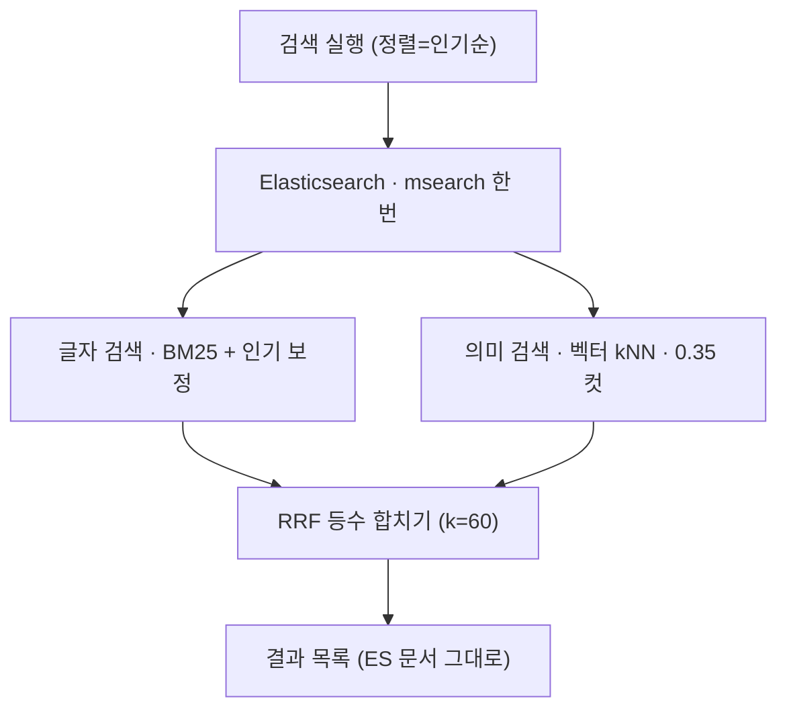
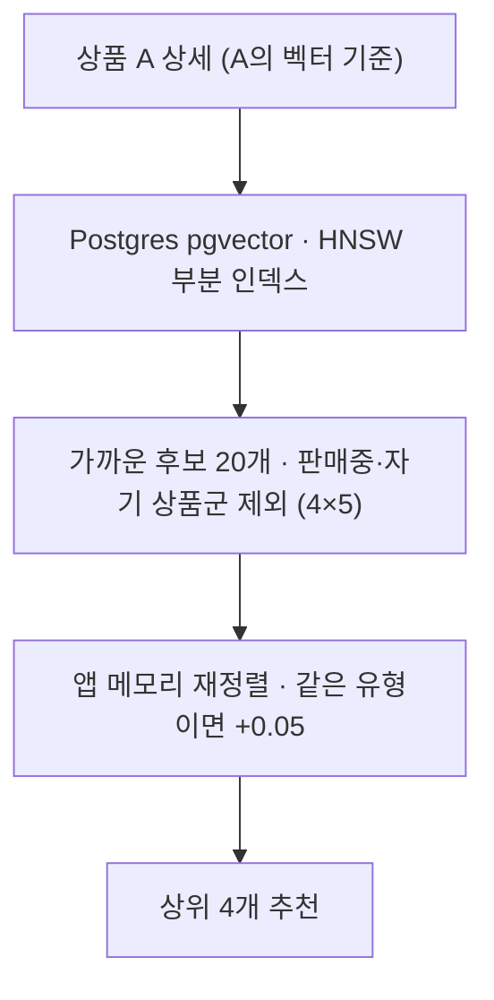

상품 검색·추천은 네 조각으로 나눠 보면 이해가 쉽다. 입력을 돕는 **자동완성**, 검색어가
있을 때 도는 **하이브리드 검색**, 그 결과를 무슨 순서로 보여줄지 정하는 **인기순 정렬**,
그리고 상세 페이지의 **유사 상품 추천**이다. 이 글은 각 기능의 개념과 실제 구현값, 그리고
"왜 그렇게 했는가"를 정리한다.

## 설계를 관통하는 4가지 원칙

개별 결정을 외우기 전에, 대부분의 선택을 설명하는 네 가지 원칙을 먼저 잡아두면 좋다.

1. **검색은 멈추면 안 된다.** 의미 검색·자동완성·추천은 "있으면 좋은 것"이지 없으면 서비스가
   죽는 것이 아니다. 그래서 실패하면 조용히 축소된다 — 의미 검색이 느리면 글자 검색만, ES가
   죽으면 DB 검색으로, 자동완성이 실패하면 그냥 드롭다운만 안 뜬다.
2. **점수를 섞지 않고 등수를 섞는다.** 글자 점수(BM25)는 상한이 없고 벡터 유사도(코사인)는
   0~1이라 스케일이 다르다. 그대로 더하면 데이터가 바뀔 때마다 보정 상수를 다시 잡아야 한다.
   그래서 순위 병합은 점수를 버리고 등수만 쓴다(RRF).
3. **임계값은 결과로 조정한다.** 0.35·0.05·가중치 같은 값은 배포 전에 벡터 분포를 잴 수 없어
   실측 없이 잡은 첫 컷이다. 대신 조정 신호가 검색 결과로 드러나게 설계했다 — 무관한 게 섞이면
   올리고, 뜻으로 찾을 게 안 나오면 내린다.
4. **코사인이 0~1로 유계라는 점을 활용한다.** 유사도가 항상 0~1이라 "0.05 가산점"이 "다른
   유형이 같은 유형을 이기려면 유사도가 0.05 더 높아야 한다"로 직접 해석된다. 임계값·가산점이
   숫자가 아니라 의미로 읽힌다.

## 반드시 이해할 핵심 개념

### 글자 검색과 BM25
내가 친 단어가 상품의 이름·태그·설명·본문에 **글자 그대로** 들어 있는지 보는 방식이다. 점수는
BM25로 매긴다 — 흔한 단어는 가중치를 낮추고, 문서에 그 단어가 여러 번 나오면 점수를 올리되
무한정 올리지는 않는(포화) 표준 랭킹 함수. 정확하지만 글자가 안 겹치면 못 찾는다.

### 임베딩(벡터)과 코사인 유사도
문장을 숫자 1,536개짜리 좌표(벡터)로 바꾼 것이 임베딩이다. 좌표가 가까우면 "뜻이 비슷하다"고
본다. 가까운 정도는 **코사인 유사도**로 재는데, 두 벡터가 이루는 각도만 보기 때문에 값이 항상
0~1 사이로 유계다. "회의록 정리"와 "미팅 노트 자동화"는 글자가 안 겹쳐도 좌표가 가까워
서로를 찾아낸다.

### kNN과 HNSW(근사 최근접 탐색)
kNN은 "질의 벡터와 가장 가까운 k개"를 찾는 것이다. 문제는 상품이 많아지면 전부와 거리를
계산하기 비싸다는 것. **HNSW**는 벡터들 사이에 지름길 그물망을 미리 깔아, 그 길만 따라 빠르게
가까운 것에 도달하는 구조다. 전수 비교를 안 하므로 빠르지만 아주 드물게 진짜 1등을 놓칠 수
있는 **근사(ANN)** 방식이다. 그래서 후보를 넉넉히 훑게 한다(`numCandidates`).

### 양자화(int8_hnsw)
벡터 좌표 하나가 원래 4바이트(float)인데, 이를 1바이트(int8, 256단계)로 반올림해 저장하는
압축이다. 용량이 1/4로 줄고 탐색이 빨라진다. 정밀도가 조금 떨어지지만 "가까운 것 찾기"에는
영향이 거의 없다. 사진을 적당한 화질로 저장하는 것과 같다.

### RRF(Reciprocal Rank Fusion)
글자 검색 결과와 의미 검색 결과, 두 순위표를 하나로 합치는 규칙이다. 각 목록에서의 등수로부터
`1 / (k + 등수)`를 주고 더한다. 두 목록 모두에서 상위인 문서가 위로 올라간다. 점수의 절대값을
버리고 등수만 쓰므로 스케일이 다른 두 검색을 공정하게 합칠 수 있다.

### function_score · log1p · gauss decay
인기순 정렬의 점수 계산기다. 글자 매칭 점수 위에 네 가지 인기 신호를 곱해 얹는다.
- **log1p**: 판매수·조회수는 상한이 없어 인기 상품 하나가 점수를 독식할 수 있다. `log(1+x)`로
  누르면 큰 값의 영향이 완만해진다.
- **gauss decay(신선도)**: 등록일이 최근일수록 높은 점수를 주고 시간이 지나면 종 모양으로
  감쇠시킨다. "scale=30일, decay=0.7"이면 30일 지난 상품의 신선도 기여가 0.7배가 된다.

### LRU 캐시
Least Recently Used — 가장 오래 안 쓴 항목부터 버리는 캐시. 최근 검색어 벡터를 한도(1,000개)
안에서 들고 있다가 넘치면 오래된 것부터 지운다.

## 기능별 구현과 설계 의도

### ① 자동완성 — 상품명 제안

검색창에 타이핑하면 두 곳에서 추천이 온다. **최근 검색어**는 브라우저에 저장된 것이라 서버를
안 부르고(프론트 영역), **상품명 제안**은 백엔드가 담당한다.

- 상품명(`name`)에 대해 `match_phrase_prefix`로 **마지막 토큰을 앞글자(prefix)로** 매칭한다.
  "코드리뷰 프롬프트"처럼 여러 단어여도 중간 단어의 앞부분("코드")으로 걸린다.
- 정렬은 **판매수 내림차순** 하나. 점수 계산을 얹지 않는다.
- 상품명만 뽑아 중복 제거 후 최대 5개 반환한다.

**왜 이렇게** — 자동완성은 타이핑 중 매 글자마다 호출되므로 수 ms 응답이 요건이다. 그래서
function_score(인기 점수)를 재사용하지 않고 판매수 단일 기준으로 정렬했다. 제안어 몇 개를
고르는 데 신선도·평점의 기여는 미미하다고 판단했다. ES 조회가 실패하면 예외를 던지지 않고 빈
목록을 반환한다 — 자동완성은 드롭다운이 안 뜰 뿐 검색 자체를 막지 않으므로, 타이핑마다 500을
내는 것보다 낫다.

### ② 하이브리드 검색 — 검색어가 있을 때

검색어가 있으면 글자 검색과 의미 검색 두 갈래를 **한 번의 왕복(msearch)** 으로 동시에 조회해
순위를 합친다.
- **글자 레그**: `multi_match`(best_fields)로 `name^3`, `tags.text^2`, `description^1.5`,
  `content`를 매칭한다(이름에 가중치를 크게). `tieBreaker=0.3`. 인기순일 때는 여기에
  function_score 인기 보정을 얹는다.
- **의미 레그**: 질의 벡터로 kNN. `k=100`, `numCandidates=200`, **코사인 유사도 0.35 미만은
  컷**. 글자 레그와 **같은 필터**(상품 유형)를 건다.
- **병합**: RRF로 등수를 합쳐 최종 순위. 동점이면 실제로 단어가 들어간 글자 레그를 우선한다.
- 결과는 **ES가 준 문서로 바로** 화면을 구성한다(DB 재조회 없음).

**하이브리드 발동 조건** — (1)검색어가 있고 (2)정렬이 인기순이며 (3)상위 100건 안일 때만.
- **왜 인기순에서만**: 평점순·가격순은 그 값으로 순서가 완전히 정해져 두 레그를 섞어도 정렬이
  덮어써 무의미하다. 외부 API(벡터)만 낭비하므로 끈다.
- **왜 상위 100건만**: RRF는 순위 목록을 통째로 섞는 방식이라 페이지 단위로 나눠 계산할 수
  없다. 이 창(FUSION_WINDOW)을 넘는 페이지는 글자 검색 결과만 준다. 현재 상품 수에서는 전체가
  창에 들어오고, 100건 뒤까지 넘겨보는 사용은 사실상 없다.
- **왜 0.35 하한을 반드시**: kNN은 관련도와 무관하게 상위 k건을 채워 돌려준다. 하한이 없으면
  색인 문서가 k보다 적을 때 어떤 질의든 전체 문서가 후보로 들어와 "검색 결과 0건"이 불가능해진다.

### ③ 인기순 정렬 — 점수 매기는 법

검색 결과(글자 레그)든 검색어 없는 목록이든, 무슨 순서로 위에 올릴지를 정하는 것이 인기순이다.
정렬 기준이 **점수**라서 여기에만 하이브리드가 낄 자리가 있다(평점순·가격순은 값순).

네 가지 신호를 **가중 합산(function_score, score_mode=Sum, boost_mode=Sum)** 한다.

| 신호 | 방식 | 가중치(초기값) |
|---|---|---|
| 판매수 | log1p | 0.3 |
| 조회수 | log1p | 0.1 |
| 평점 | 값(없으면 0) | 0.1 |
| 신선도 | gauss(scale 30일, decay 0.7) | 0.2 |

**왜 이렇게** — 판매·조회수는 스케일이 무계라 log로 눌러 폭주를 막는다. 가중치는 등급 A
노브(yml 수정 + 재기동으로 조정 가능)로 뺐고, 초기값은 튜닝 설계 문서의 추측값을 그대로 가져온
것이다. 검색어가 있으면 이 점수가 ②의 글자 레그로 들어가 의미 레그와 RRF로 합쳐진다 —
그래서 ②와 ③은 이어져 있다.

### ④ 유사 상품 추천 — 상세 페이지

검색과 달리 ES가 아니라 **Postgres(pgvector)** 에서 벡터로 찾는다.
- 기준 상품과 임베딩이 가까운 순으로 **후보 20개**(요청 4개 × 5배)를 뽑는다. 조건: 판매중만,
  자기 상품군(family) 제외, 임베딩 있는 것만.
- 앱 메모리에서 재정렬: `유사도 = 1 − 코사인거리`, **같은 유형이면 +0.05 가산점**. 상위 4개.

**왜 이렇게**
- **왜 DB(pgvector)에서**: 추천은 "판매중만", "같은 상품군 제외", "기준 벡터 없으면 안전
  처리" 같은 SQL 제어와 부분 인덱스가 편하다. 검색은 RRF·function_score 랭킹이 필요해 ES가
  유리하고, 추천은 조건 제어가 핵심이라 DB가 유리하다.
- **왜 후보를 20개나**: 4개만 뽑으면 같은 유형이 그 자리를 다 채웠을 때 다른 유형이 후보에도
  못 들어와, 가산점이 순서를 바꿀 여지가 사라진다. 그래서 요청에 비례해 넉넉히 뽑는다.
- **왜 정렬을 앱에서**: DB의 `ORDER BY`를 **순수 거리 연산자(`<=>`)** 로만 둬야 ON_SALE 부분
  HNSW 인덱스를 탄다. 여기에 가산점 산술을 얹으면 표현식이 되어 인덱스를 못 쓰고 풀스캔이
  된다. 그래서 후보만 인덱스로 빠르게 뽑고, 가산점 재정렬은 앱에서(후보 20개뿐이라 가볍다).
- **왜 인기도 항을 안 넣나**: salesCount는 스케일이 무계라 코사인 공간에 더할 근거가 없다.
  해석 가능한 항(코사인) 하나만 둔다.

### (횡단) 벡터는 어디서, 언제 만드나
- **저장 이원화**: 임베딩 원본은 **Postgres(pgvector)** 에 한 벌 두고, 검색용으로 **ES에
  사본**을 복사한다. ES 인덱스가 유실돼도 임베딩은 DB에 남아 OpenAI 재호출 없이 전체 재색인이
  끝난다.
- **생성 시점**: 상품을 저장하는 순간이 아니라 **20초 주기 재조정 배치**에서 만든다. MAJOR
  업데이트로 새 버전이 생길 때와 관리자 승인으로 판매중이 될 때는 이벤트가 발행되지 않아, 쓰기
  경로에 붙이면 그 두 경우의 임베딩이 영영 안 생긴다. 배치가 `updated_at` 기준으로 훑으면 그
  경로까지 커버된다. 대신 최대 20초 지연을 받아들인다.
- **불필요 재생성 차단**: 조회수만 올라도 `updated_at`이 바뀌어 배치 대상이 된다. 그래서 원문의
  **SHA-256 해시**를 저장해 두고, 안 바뀌었으면 OpenAI 호출을 건너뛴다.
- **자기 꼬리 무는 루프 방지**: 임베딩 저장은 네이티브 UPDATE로 해서 `updated_at`을 건드리지
  않는다. 안 그러면 임베딩을 쓸 때마다 그 상품이 다음 배치 대상으로 다시 걸린다.

## 모든 수치의 근거

| 값 | 무엇 | 근거 |
|---|---|---|
| 1536 | 임베딩 차원 | text-embedding-3-small의 출력 차원(고정) |
| 0.35 | 코사인 유사도 하한 | 실측 전 첫 컷. 무관한 게 섞이면 ↑, 뜻으로 찾을 게 안 나오면 ↓ |
| k=60 | RRF 상수 | RRF 논문(2009) 표준값. 1·2등 격차를 완만하게 |
| 100 | RRF 병합 창 | 페이지로 못 나눠 상위 N만 병합. 100건 뒤 사용 거의 없음 |
| ×2 | numCandidates | HNSW가 상위 k를 놓치지 않게 후보를 넉넉히 |
| 0.05 | 유형 가산점 | 코사인 0~1이라 "이기려면 유사도 0.05 더 필요"로 해석 |
| ×5 | 추천 후보 배수 | 같은 유형이 자리를 다 채워도 다른 유형이 후보에 들게 |
| 4 | 추천 개수 | FE 요청 기본값 |
| 300ms | 질의 임베딩 예산 | 넘으면 글자 검색만. 검색이 외부 API 지연을 따라가면 안 됨 |
| 1000 | 질의 벡터 LRU | 벡터 하나 ~6KB, 1000개 ≈ 6MB. 검색어 다양성 대비 넉넉 |
| 0.3/0.1/0.1/0.2 | 판매/조회/평점/신선도 가중치 | 튜닝 설계 문서의 추측 초기값. 등급 A 노브(yml) |
| 30일/0.7 | 신선도 scale/decay | 추측 초기값. 결과 보고 조정 |
| name^3 등 | 매칭 필드 가중치 | 이름 일치가 가장 강한 신호라는 판단 |

## 설계 의도 총정리 (자주 나오는 "왜")

- **왜 값을 대부분 설정으로 안 뺐나** — config server가 설정을 이미지에 구워서 yml을 고쳐도
  머지·재배포가 필요하다(커밋 ≠ 반영). 노브로 빼도 조정이 빨라지지 않으므로, 자주 만질 값(랭킹
  가중치)만 노브로 두고 나머지(0.35, 0.05)는 상수로 뒀다. 기준은 "조정 빈도 예상".
- **왜 실측값이 아닌 추측값으로 시작했나** — 질의 벡터를 만들려면 배포 후 OpenAI 호출이 필요해
  사전에 분포를 잴 수 없었다. 대신 조정 신호가 결과로 드러나게 설계했다.
- **왜 한글 형태소 분석기(nori)를 안 쓰나** — 예전에 커스텀 분석기가 "보고서"를 "보/고서"로
  잘못 쪼갰다. 검색어와 문서가 똑같이 왜곡돼 문제가 눈에 안 띄어 더 위험했다. 걷어내고 기본
  분석기를 쓰며, 형태소 문제는 의미(벡터) 검색이 상당 부분 흡수한다.
- **왜 Redis 대신 앱 메모리 캐시** — 모든 서비스가 replicas 1이라 인스턴스 간 공유 이득이
  없고, 캐시 미스 비용이 OpenAI 호출 한 번이다. 의존성·직렬화를 감당할 근거가 없다.
  replicas가 2 이상이 되면 그때 Redis로 옮긴다.

## 예상 질문 (Q&A 완전판)

### 개념

<b>🔍 글자 검색과 의미 검색의 차이?</b>

글자 검색은 친 단어가 그대로 들어간 상품을, 의미 검색은 단어가 달라도 뜻이 가까운 상품을
찾는다. 전자는 정확하지만 표현이 다르면 놓치고, 후자가 그 빈틈을 메운다.

<b>🔍 RRF가 뭐고 왜 쓰나?</b>

두 검색의 점수 체계가 달라(BM25 무계 vs 코사인 0~1) 그냥 더하면 한쪽이 이긴다. 그래서 점수
대신 등수만 합친다. 두 검색 모두에서 상위인 문서가 올라온다.

<b>🔍 HNSW가 근사라는데 정확도 손해는?</b>

아주 드물게 진짜 1등을 놓칠 수 있지만, 상품 검색·추천은 "정확히 그 1등"이 아니라 "충분히
가까운 좋은 것 몇 개"면 된다. 그 대가로 전수 비교보다 훨씬 빠르다. numCandidates를 넉넉히 줘
놓칠 확률도 낮췄다.

### 설계 선택

<b>🔍 왜 검색은 ES, 추천은 pgvector로 나눴나? 벡터를 두 곳에 두는 게 낭비 아닌가?</b>

필요한 게 다르다. 검색은 RRF·function_score 랭킹이 핵심이라 ES가, 추천은 SQL 제어·부분
인덱스가 편해 DB가 유리하다. 원본은 Postgres 한 곳이고 ES는 검색용 사본이라, 오히려 ES 유실
시 재색인이 싸진다.

<b>🔍 왜 하이브리드를 항상 안 하나?</b>

평점순·가격순은 값으로 순서가 굳어져 벡터를 섞어도 무의미하다. 외부 API만 낭비하므로 인기순
에서만 켠다.

<b>🔍 RRF 대신 점수 가중합은 안 되나?</b>

스케일이 다른 두 점수를 합치려면 정규화 상수가 필요한데, 데이터가 바뀔 때마다 다시 잡아야 해
유지되지 않는다. 등수 기반 RRF는 그 문제가 없다.

<b>🔍 왜 추천 순위를 DB가 아니라 앱에서?</b>

ORDER BY를 순수 거리로 둬야 HNSW 인덱스를 탄다. 가산점 산술을 얹으면 인덱스를 못 쓰고
풀스캔이 된다. 후보 20개뿐이라 앱 재정렬이 가볍다.

<b>🔍 왜 임베딩을 저장 시점이 아니라 배치에서?</b>

승인·새 버전 경로는 이벤트가 없어 쓰기 경로에 붙이면 임베딩이 누락된다. 배치가 updated_at으로
훑어 전 경로를 커버하고, 대신 20초 지연을 받아들인다.

### 트레이드오프·운영

<b>🔍 임베딩 20초 지연 괜찮나?</b>

새 상품이 추천·의미 검색에 20초 늦게 반영될 뿐 노출·구매엔 영향이 없다. 실시간이 꼭 필요한
기능이 아니라 수용 가능한 지연이다.

<b>🔍 ES가 죽으면?</b>

검색은 곧바로 DB의 LIKE 검색으로 폴백해 멈추지 않는다. 자동완성은 빈 목록을 준다. 추천은
애초에 DB라 영향 없다.

<b>🔍 Postgres와 ES 정합성은?</b>

Postgres가 원본이고 ES는 사본이다. 20초 재조정 배치와 기동/일일 전체 재조정이 드리프트·고아
문서를 정리한다. product-service 자체 변화는 이벤트로 실시간 반영된다.

<b>🔍 상품 수가 적은데 이게 다 필요한가?</b>

지금 규모에선 과한 면이 있다. 다만 벡터·RRF·부분 인덱스 구조는 상품이 늘어도 그대로 확장되게
설계한 것이고, 지금은 "동작을 검증한 상태"로 본다.

<b>🔍 replicas를 늘리면?</b>

질의 벡터 캐시를 앱 메모리에서 Redis로 옮긴다. 그 전까지는 인스턴스별 로컬 캐시로 충분하다.

<b>🔍 OpenAI 호출이 실패하면?</b>

임베딩 배치는 실패한 상품의 해시를 저장하지 않아 다음 사이클에 다시 시도한다 — 주기 자체가
재시도다. 질의 임베딩은 300ms를 넘기면 글자 검색만으로 응답한다.

