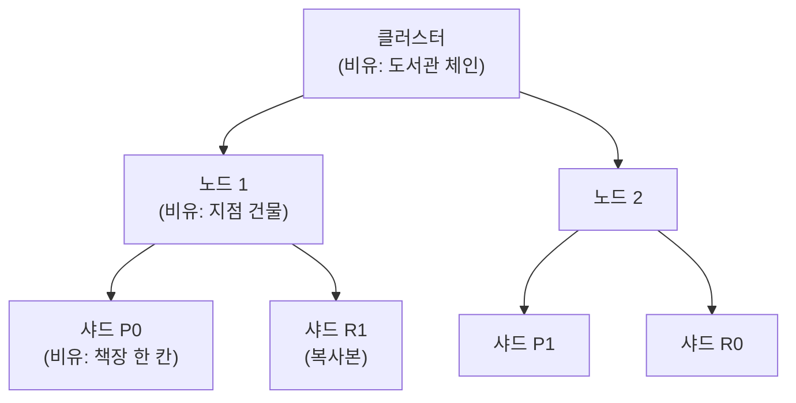

상품 검색, 검색어 자동완성, 행동 로그 분석, 개인화 추천 — 이걸 전부 Elasticsearch(이하 ES)로 설계하려고 한다.
그 출발점으로 "검색은 왜 그냥 DB로 하면 안 되는가"와 "ES는 안에서 어떻게 생겼는가"를 먼저 잡는다.

## 검색은 왜 RDB로 하면 안 되나

상품명에서 "무선 이어폰"을 찾는다고 하자. RDB라면 보통 이렇게 쓴다.

```sql
SELECT * FROM product WHERE name LIKE '%무선 이어폰%';
```

문제가 세 가지다.

- **느리다.** `LIKE '%...%'`는 앞에 와일드카드가 있어 인덱스를 못 탄다. 전체 행을 훑는다(풀 스캔).
- **정확 매칭만 된다.** "무선이어폰"(붙여쓰기), "이어폰 무선"(순서 바뀜), "블루투스 이어폰"(유의어)은 못 잡는다.
- **순위가 없다.** 조건에 맞으면 다 나올 뿐, "누가 더 관련 있나"를 모른다. 검색은 **정렬(랭킹)**이 핵심인데 그게 없다.

검색 시스템은 이 셋을 다르게 푼다. 그 핵심 장치가 **역색인**이다.

## 역색인(Inverted Index)

책 뒤의 "찾아보기(색인)"를 떠올리면 된다. "이 단어가 몇 페이지에 나오는가"를 미리 표로 만들어 둔 것.
ES는 문서를 넣을 때(색인, indexing) 텍스트를 **단어(term) 단위로 쪼개서** "이 단어 → 이 단어가 든 문서들" 표를 만든다.

상품 3개를 넣으면:

| 문서 | 상품명 |
|---|---|
| 1 | 무선 이어폰 |
| 2 | 무선 마우스 |
| 3 | 블루투스 이어폰 |

ES는 이런 역색인을 만든다:

| term | 문서 목록 |
|---|---|
| 무선 | 1, 2 |
| 이어폰 | 1, 3 |
| 마우스 | 2 |
| 블루투스 | 3 |

"무선 이어폰"을 검색하면 "무선"(→1,2)과 "이어폰"(→1,3)을 **표에서 즉시 찾아** 합친다.
문서 1은 둘 다 들어 있어 점수가 높고, 2·3은 하나만 맞아 낮다 → **자연스럽게 순위가 나온다.**
풀 스캔이 아니라 표 조회라 빠르고, 단어 단위라 순서·붙여쓰기에 강하다.

여기서 "텍스트를 어떻게 단어로 쪼개느냐"가 검색 품질을 좌우한다. 그게 **분석기(analyzer)**이고, 한글은 조사·붙여쓰기 때문에 **형태소 분석(nori)**이 필요하다. 자세히는 [3번 노트](/study/es/analyzer-and-nori)에서 다룬다.

<details>
<summary><b>🔍 형태소 분석, nori가 뭔데?</b></summary>

영어는 띄어쓰기로 단어가 갈리지만, 한글은 "무선이어폰을"처럼 조사가 붙고 붙여쓰기도 흔하다. 그냥 공백으로만 쪼개면 "무선이어폰을"이 통째로 한 단어가 돼서 "이어폰"으로 검색해도 안 걸린다. **형태소 분석**은 한글을 의미 단위(무선 / 이어폰 / 을)로 제대로 쪼개는 것이고, **nori**는 ES 공식 한글 형태소 분석기다. 상품 검색 품질의 핵심이라 [3번 노트](/study/es/analyzer-and-nori)에서 깊게 다룬다.

</details>

## ES의 물리 구조

ES는 분산 시스템이다. 각 요소의 **정의**가 먼저이고, 뒤의 *(비유:…)*는 이해를 돕는 부가 설명(도서관 체인)일 뿐이다.



- **클러스터** — ES 노드(서버)들을 하나로 묶은 단위. 같은 클러스터 이름을 가진 노드들이 자동으로 한 팀이 된다. *(비유: 도서관 체인 전체 — 여러 지점을 한 브랜드로 운영)*
- **노드** — ES 프로세스 하나(보통 서버 1대). 데이터 저장·검색·클러스터 관리를 맡는다. *(비유: 지점 건물 하나)*
- **인덱스** — 같은 성격의 문서 묶음. RDB의 테이블에 가깝다. 예: `products`, `search-logs`. *(비유: 한 주제의 서가 전체)*
- **문서** — 인덱스 안의 데이터 한 건(JSON). RDB의 행(row). *(비유: 책 한 권)*
- **샤드** — 인덱스를 물리적으로 쪼갠 조각. 인덱스가 커지면 한 노드에 다 못 담으니 여러 샤드로 나눠 여러 노드에 흩어 담는다. 샤드 하나 = 루씬 인덱스 하나. *(비유: 서가를 나눠 담은 책장 한 칸)*
- **레플리카** — 샤드의 복제본. 노드가 죽어도 데이터가 살아있게(고가용성) 하고, 검색 요청을 나눠 받아 성능을 올린다. *(비유: 그 책장의 복사본을 다른 지점에도 둠)*
- **세그먼트** — 샤드 안의 실제 역색인 파일. 한 번 쓰이면 수정되지 않는다(불변). 문서를 추가하면 새 세그먼트가 생기고 나중에 병합된다. 운영 얘기라 [9번 노트](/study/es/operations-and-tuning)에서. *(비유: 책장 안의 실제 색인 카드 묶음)*

<details>
<summary><b>🔍 "분산 설계라 수평 확장이 쉽다"는 게 무슨 말?</b></summary>

데이터가 늘면 두 가지 길이 있다. (1) **수직 확장** — 서버 1대의 CPU·메모리를 키운다. 한계가 있고 비싸다. (2) **수평 확장** — 값싼 서버를 여러 대로 늘린다. ES는 인덱스를 **샤드로 쪼개 여러 노드에 자동으로 흩어 담기** 때문에, 노드(서버)를 추가하면 샤드가 새 노드로 재배치되며 저장 용량과 검색 처리량이 같이 늘어난다. "서버를 옆으로 늘리기만 하면 커진다"는 게 수평 확장이고, 도서관에 비유하면 지점을 하나 더 여는 것이다.

</details>

## 근실시간(NRT, Near Real-Time)

ES는 "실시간"이 아니라 **근실시간**이다. 문서를 색인해도 **약 1초 뒤**에 검색에 잡힌다.
색인한 문서를 메모리에 잠깐 모았다가 **약 1초마다 검색 가능한 형태로 반영(refresh)**하기 때문이다. 이 주기는 `refresh_interval` 설정으로 조절한다.

이걸 알아야 설계가 안 꼬인다. "상품 등록 직후 목록에 바로 보여야 한다"면 그 1초 지연을 UX로 흡수하거나 강제 새로고침을 해야 한다.

<details>
<summary><b>🔍 refresh_interval이 뭐야?</b></summary>

색인한 문서를 "검색 가능한 상태로 만드는" 주기다. 기본값 **1초**(`refresh_interval: 1s`). 이 주기마다 메모리 버퍼의 새 문서들이 검색 가능한 세그먼트로 바뀐다. 그래서 색인 후 최대 1초 뒤 검색에 잡힌다. 대량 색인(초기 데이터 적재)을 할 땐 이 값을 늘리거나 잠시 꺼서 색인 속도를 크게 올리기도 한다.

</details>

<details>
<summary><b>🔍 flush는 또 뭐야?</b></summary>

refresh가 "검색 가능하게" 만드는 거라면, flush는 "메모리의 변경분을 **디스크에 영구 저장**"하는 것이다. ES는 색인 요청을 먼저 트랜잭션 로그(translog)에 적어 두고, 주기적으로 flush 하며 실제 디스크 세그먼트로 확정한다. 그래서 서버가 갑자기 죽어도 translog로 복구된다. refresh(검색 가시성)와 flush(영속성)는 별개의 동작이다 — 자세히는 9번 노트에서.

</details>

## ES가 강력한 이유 / 약점

**강한 이유**

- 역색인 기반이라 **전문(full-text) 검색이 빠르고**, 관련도 순위(랭킹)를 기본 제공한다.
- **수평 확장**이 쉽다 — 노드(서버)를 늘리면 샤드가 새 노드로 퍼지며 저장 용량과 검색 처리량이 같이 늘어난다. *(수직 확장과의 차이는 위 토글)*
- **집계(aggregation)**가 강력해서 검색엔진이자 분석엔진이다 — 인기 검색어·트렌드 분석이 여기서 나온다([6번 노트](/study/es/aggregation-log-analysis)).

**약점 (설계 시 감안)**

- **트랜잭션이 없다.** → 원본(주문·결제)은 RDB에 두고, ES는 검색·분석용 복제본으로 쓰는 게 정석.
- **조인이 없다.** 비정규화(한 문서에 필요한 걸 다 담기)로 설계해야 한다.
- **근실시간.** 위의 1초 지연.
- **잦은 부분 수정에 약하다.** 세그먼트가 불변이라 재색인/배치 갱신에 맞는다.

<details>
<summary><b>🔍 "ACID/트랜잭션 보장이 없다"는 게 무슨 말?</b></summary>

RDB는 "여러 작업을 하나로 묶어 전부 성공 아니면 전부 취소"를 보장한다(트랜잭션). 예: 계좌 이체에서 출금과 입금이 한 묶음으로 처리돼, 중간에 실패하면 둘 다 되돌린다. ES에는 이런 다중 문서 트랜잭션이 **없다.** 그래서 "결제=출금+입금+포인트차감"처럼 **정합성이 생명인 데이터는 RDB에** 두고, ES는 그 데이터를 검색·분석하기 위한 **복제본**으로만 쓴다. 검색 결과가 1초 늦거나 살짝 어긋나도 치명적이지 않기 때문에 이 역할 분리가 안전하다.

</details>

<details>
<summary><b>🔍 재색인·배치 갱신이 뭐야?</b></summary>

**재색인(reindex)** = 인덱스의 문서들을 새 인덱스로 다시 색인하는 것. 매핑(필드 구조)을 바꾸거나 분석기를 바꾸면 기존 데이터에 소급 적용이 안 돼서, 새 인덱스를 만들고 데이터를 옮겨 담는다. **배치 갱신** = 문서를 한 건씩 실시간으로 고치는 대신, 모아서 주기적으로(예: 밤마다) 한꺼번에 갱신하는 방식. ES는 세그먼트가 불변이라 한 건씩 자주 고치면 비용이 크므로, 이렇게 모아서 처리하는 게 잘 맞는다.

</details>

## 예전 버전에서 달라진 점 (9.x 기준)

지금은 9.x로 설계한다. 예전 버전을 다룬 자료를 볼 때 헷갈리지 않게 달라진 것만 짚어둔다.

- **타입(`_type`) 제거.** 예전(6.x 이하)엔 한 인덱스 안에 여러 '타입'을 뒀고 URL이 `/{index}/{type}/{id}`였다. **7.0에서 타입이 사라졌고** 8.x·9.x엔 완전히 없다. 이제 `/{index}/_doc/{id}`, "인덱스 하나 = 문서 종류 하나"로 설계한다.
- **보안 기본 활성화.** **8.x부터** 설치 시 TLS·인증이 **기본으로 켜진다**(9.x도 동일). 예전 예제처럼 인증 없이 `http://localhost:9200`에 붙는 코드는 그대로 안 된다.
- **`_all` 메타필드 제거.** 예전의 `_all`(모든 필드를 합쳐 한 번에 검색)은 폐기됐다. 대신 `copy_to`나 `multi_match`를 쓴다.

## 이 시스템에 어떻게 쓰나

내가 만들 것과 연결하면:

- **상품 검색** — 상품명·설명을 역색인으로. 분석기(nori)로 한글을 제대로 쪼개는 게 품질의 핵심([3번 노트](/study/es/analyzer-and-nori)).
- **검색어 제안(자동완성·오타교정)** — 별도 색인 구조로 푼다([5번 노트](/study/es/search-suggest-autocomplete)).
- **행동 로그 분석** — 검색·클릭·구매 이벤트를 날짜별 인덱스로 쌓고 집계로 분석([6번](/study/es/aggregation-log-analysis)·[7번 노트](/study/es/search-event-log-pipeline)).
- **개인화 추천** — 원본 행동데이터는 RDB/로그에, ES는 검색+랭킹 계층으로. `function_score`로 개인화 신호를 점수에 반영([4번](/study/es/query-dsl-and-relevance)·[8번 노트](/study/es/behavioral-recommendation-design)).

정리하면 **원본 진실은 RDB, 검색·분석·랭킹은 ES.** 이 역할 분리가 이후 모든 설계의 바탕이 된다.
