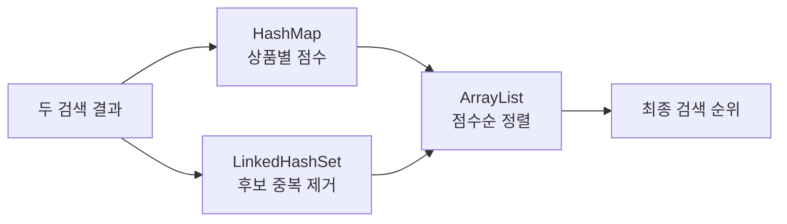

## 먼저 코드가 하려는 일을 보자

현재 프로젝트는 글자 기반 검색 결과와 의미 기반 검색 결과를 하나의 순위로 합친다.

```text
글자 기반 [A, B, C] ─┐
                     ├→ 점수 합산과 중복 제거 → 최종 순위
의미 기반 [B, D, A] ─┘
```

여기에는 세 가지 일이 필요하다.

```text
상품별 점수를 찾는다 → 중복 상품을 제거한다 → 점수순으로 정렬한다
```

컬렉션 이름부터 외우기보다 필요한 일을 먼저 보면 선택 이유가 보인다.

## HashMap은 상품별 점수를 저장한다

```java
Map<UUID, Double> scores = new HashMap<>();
```

```text
상품 A → 0.032
상품 B → 0.031
상품 C → 0.016
```

같은 상품이 두 검색 결과에 나오면 `merge()`로 점수를 더하고, 정렬할 때 `get()`으로 찾는다.
HashMap의 순회 순서를 검색 순위로 사용하지는 않는다.

## LinkedHashSet은 중복을 제거하며 순서를 기억한다

`Set`은 같은 값을 중복 저장하지 않는다. `LinkedHashSet`은 중복을 제거하면서 처음 입력된
순서도 유지하는 구현체다.

```text
글자 기반: [A, B, C]
의미 기반: [B, D, A]

A 추가 → [A]
B 추가 → [A, B]
C 추가 → [A, B, C]
B 추가 → 이미 있으므로 변화 없음
D 추가 → [A, B, C, D]
A 추가 → 이미 있으므로 변화 없음
```

이 순서는 동점 처리의 안정적인 출발점이 되고, 최종 순위는 다음 정렬 단계에서 결정한다.

## ArrayList는 최종 후보를 정렬한다

```java
List<UUID> fused = new ArrayList<>(candidates);
fused.sort(...);
```

```text
정렬 전 [A, B, C, D]

A → 0.031
B → 0.040
C → 0.016
D → 0.015

정렬 후 [B, A, C, D]
```

ArrayList는 인덱스로 접근하고 원소 위치를 바꾸면서 정렬하는 작업에 알맞다.



| 컬렉션 | 이 코드에서 맡는 일 |
|---|---|
| `HashMap` | 상품 ID로 점수를 저장하고 조회 |
| `LinkedHashSet` | 후보 중복을 제거하고 최초 입력 순서 유지 |
| `ArrayList` | 후보를 담아 최종 점수순으로 정렬 |

<details>
<summary><b>🔍 컬렉션 이름이 많은데 전부 외워야 하나?</b></summary>

먼저 인터페이스의 목적만 구분한다.

- `List`: 순서가 있는 목록
- `Set`: 중복 없는 값의 모음
- `Map`: key로 value를 찾는 구조

그다음 코드에 필요한 특성에 맞춰 구현체를 고른다. 이 코드에서는 일반 목록과 정렬에
`ArrayList`, 중복 제거와 입력 순서 유지에 `LinkedHashSet`, 빠른 key 조회에 `HashMap`을 쓴다.

</details>

## Map 조회가 O(1)이어도 전체 메서드는 O(1)이 아니다

상품 하나의 점수를 HashMap에서 찾는 비용은 좋은 분산 조건에서 평균 O(1)이다. 하지만 검색
결과 전체를 순회해 점수를 누적하고, 후보를 정렬하는 작업은 별도로 남아 있다.

후보가 `n`개라면 정렬이 전체 비용을 주도해 일반적으로 O(n log n)으로 볼 수 있다. 코드 일부의
복잡도를 메서드 전체의 복잡도로 확대해서 말하면 안 된다.

## 같이 읽기

- [HashMap은 충돌을 처리하면서 어떻게 값을 찾는가](/study/jvm/hashmap-collision-resize-and-lookup)
- [ArrayList와 LinkedList 중 무엇을 선택할까](/study/jvm/arraylist-vs-linkedlist)
- [RRF — 점수가 다른 두 검색 결과를 어떻게 합치나](/study/es/reciprocal-rank-fusion)
