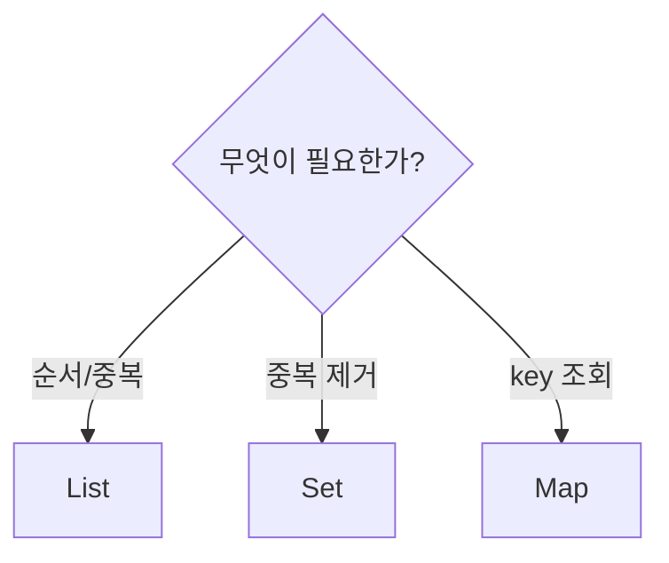

## 핵심

- `List`: 순서가 있고 중복을 허용한다.
- `Set`: 중복을 허용하지 않는다.
- `Map`: key로 value를 찾는다.



변수는 가능한 한 구현체보다 인터페이스로 선언한다.

```java
List<ProductSearchHit> hits = new ArrayList<>();
Map<UUID, Product> productsById = new HashMap<>();
```

제네릭은 컬렉션에 들어갈 타입을 컴파일 시점에 제한한다. 그래서 꺼낼 때 형변환을 반복하지 않아도 된다.

<details>
<summary><b>면접에서 한 단계 더 묻는 내용</b></summary>

`HashMap`은 hashCode로 후보 위치를 찾고 equals로 같은 key인지 확인한다. 따라서 mutable key, 잘못된 equals/hashCode 구현, 동시 수정 문제를 함께 생각해야 한다.

</details>
