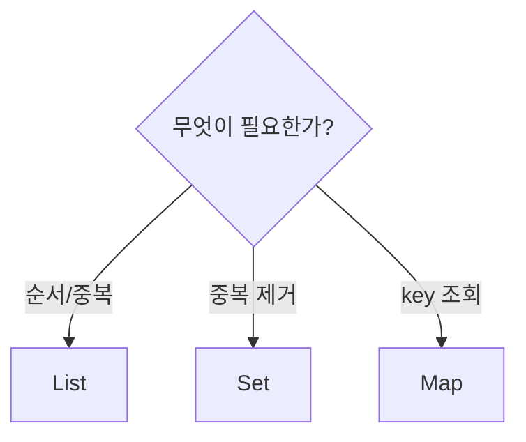

## 핵심

- `List`: 순서가 있고 중복을 허용한다.
- `Set`: 중복을 허용하지 않는다.
- `Map`: key로 value를 찾는다.

```text
List → 순서가 있는 목록
Set  → 중복 없는 값의 모음
Map  → key와 value의 짝
```


```mermaid
flowchart TD
  Q{무엇이 필요한가?}
  Q -->|순서/중복| L[List]
  Q -->|중복 제거| S[Set]
  Q -->|key 조회| M[Map]
```

변수는 가능한 한 구현체보다 인터페이스로 선언한다.

```java
List<ProductSearchHit> hits = new ArrayList<>();
Map<UUID, Product> productsById = new HashMap<>();
```

## Map과 HashMap은 무엇이 다른가

상품 번호로 상품 이름을 찾는 상황을 생각해보자.

```text
A101 → 노트
B205 → 연필
```

`Map`은 key와 value를 저장하고 조회하는 기능을 정의한 **인터페이스**다. 내부에서 데이터를
어떻게 보관할지는 정하지 않는다.

```text
Map
├── HashMap       해시로 위치를 찾는다
├── LinkedHashMap 입력 순서도 기억한다
└── TreeMap       key를 정렬해서 관리한다
```

`HashMap`은 그중 해시 테이블 방식으로 `Map`을 구현한 클래스다.

```java
Map<String, String> products = new HashMap<>();
products.put("A101", "노트");
String productName = products.get("A101");
```

왼쪽의 `Map`은 이 변수로 사용할 기능을 나타내고, 오른쪽의 `HashMap`은 실제 저장 방법을
나타낸다.

<details>
<summary><b>🔍 Map과 HashMap은 똑같은가?</b></summary>

똑같지는 않다. `Map`은 key로 value를 다루는 규칙이고, `HashMap`은 그 규칙을 해시 테이블로
구현한 클래스다. 따라서 **HashMap은 Map의 한 종류**라고 이해하면 된다.

구현체를 바꾸면 정렬 순서나 입력 순서 같은 특성도 달라지므로 아무 구현체나 항상 같은 의미로
교체할 수 있는 것은 아니다.

</details>

제네릭은 컬렉션에 들어갈 타입을 컴파일 시점에 제한한다. 그래서 꺼낼 때 형변환을 반복하지 않아도 된다.

<details>
<summary><b>면접에서 한 단계 더 묻는 내용</b></summary>

`HashMap`은 hashCode로 후보 위치를 찾고 equals로 같은 key인지 확인한다. 따라서 mutable key, 잘못된 equals/hashCode 구현, 동시 수정 문제를 함께 생각해야 한다.

</details>

## 이어서 읽기

- [HashMap은 충돌을 처리하면서 어떻게 값을 찾는가](/study/jvm/hashmap-collision-resize-and-lookup)
- [ArrayList와 LinkedList 중 무엇을 선택할까](/study/jvm/arraylist-vs-linkedlist)
