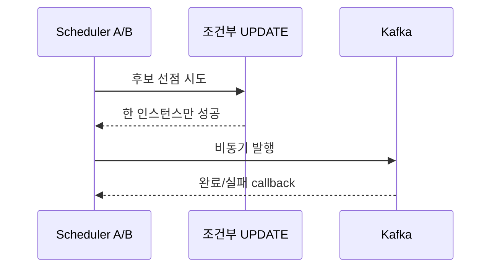

## 핵심

스레드가 여러 개라는 사실보다 중요한 것은 공유 상태를 누가 언제 바꾸는가다. 재시도 스케줄러에서는 조회만으로 선점했다고 생각하면 두 인스턴스가 같은 작업을 처리할 수 있다. 조건부 UPDATE나 unique index처럼 원자적인 경계가 필요하다.

Kafka의 `send`가 반환되었다고 발행 성공이 끝난 것은 아니다. `CompletableFuture`의 완료·실패 콜백까지 관찰해야 실제 결과를 기록할 수 있다.

<b>면접에서 설명할 순서</b>

1. 공유 데이터는 무엇인가?
2. 동시에 실행되면 어떤 중복·유실이 생기는가?
3. 원자성은 DB, lock, queue 중 어디에서 보장하는가?
4. 실패를 호출자와 로그에 어떻게 전달하는가?

