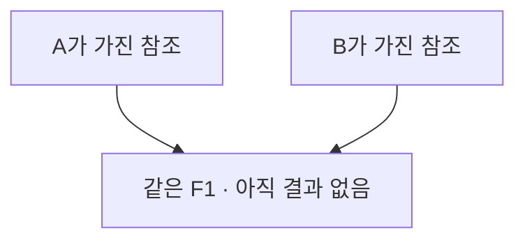
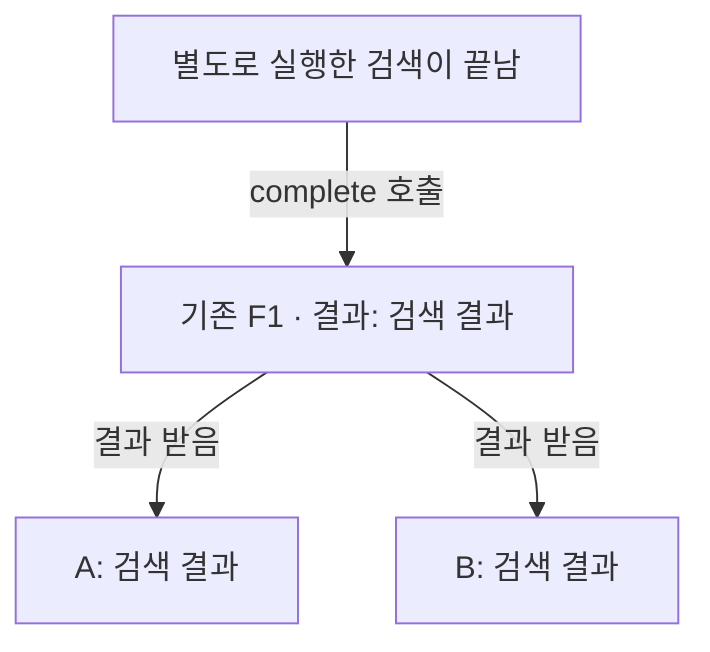
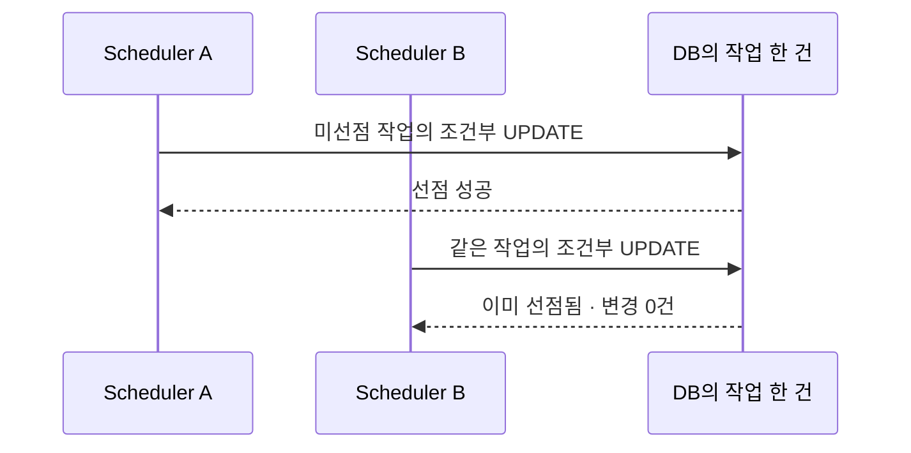

## 01 · A와 B가 같은 검색 결과를 기다린다

A와 B가 모두 “노트”를 검색했다. 검색 작업은 한 번만 실행하고, 둘에게 같은 결과를 주고 싶다. 이 글은 **한 JVM 안에서 같은 객체를 공유하고 검색이 성공하는 경우**를 보여준다.

`CompletableFuture`는 나중에 완료될 결과를 표현하는 **Java 표준 라이브러리 클래스**다. JDK에 포함돼 있어 별도 설치가 필요 없다. 캐시 라이브러리가 아니며 검색, 결과 저장, 중복 작업 병합은 우리가 별도로 구현해야 한다.

## 02 · 결과가 아직 없는 객체 F1을 만든다

```java
CompletableFuture<String> pending = new CompletableFuture<>();
```

`String`은 문자열 타입이다. `pending`은 우리가 붙인 변수 이름이고, **F1은 설명을 위해 객체에 붙인 별명**이다. `new`로 만든 F1은 아직 완료되지 않았다. 결과가 없다는 것은 빈 문자열이 들어 있다는 뜻이 아니다.


```mermaid
flowchart TD
  A["A가 가진 참조"] --> F["같은 F1 · 아직 결과 없음"]
  B["B가 가진 참조"] --> F
```

A와 B가 같은 F1을 가리킨다. F1을 만들기만 해서는 검색도 새 작업 스레드도 자동으로 시작되지 않는다.

## 03 · 검색이 끝나면 기존 F1을 완료한다

```java
pending.complete("검색 결과");
```


```mermaid
flowchart TD
  W["별도로 실행한 검색이 끝남"] -->|"complete 호출"| F["기존 F1 · 결과: 검색 결과"]
  F -->|"결과 받음"| A["A: 검색 결과"]
  F -->|"결과 받음"| B["B: 검색 결과"]
```

같은 객체에 완료 결과가 생겼으므로 둘 다 결과를 받을 수 있다. 기다리는 호출과 완료 후 실행할 함수를 등록하는 방식은 다르지만, 둘 다 이 완료 상태를 이용한다.

## 04 · 처음부터 결과가 있다면 completedFuture를 쓴다

```java
CompletableFuture<String> ready = CompletableFuture.completedFuture("검색 결과");
```

이번에는 **처음부터 완료된 새 객체**를 만든다. 기존 F1에 값을 넣는 호출이 아니다. `completedFuture`는 객체를 만드는 메서드이지 결과 보관함 이름이 아니다.

| 호출 | 만들어지거나 바뀌는 상태 |
| --- | --- |
| `new CompletableFuture<>()` | 아직 완료되지 않은 새 객체 |
| `pending.complete(value)` | pending이 가리키는 기존 객체를 완료 |
| `CompletableFuture.completedFuture(value)` | 해당 값으로 이미 완료된 새 객체 |

이 차이는 [Java 21 API](https://docs.oracle.com/en/java/javase/21/docs/api/java.base/java/util/concurrent/CompletableFuture.html)에 정의돼 있다. 2026-10-08 확인.

<details>
<summary>import부터 결과를 받는 것까지 한 번에 실행하기</summary>

```java
import java.util.concurrent.CompletableFuture;

public class FutureStatesDemo {
    public static void main(String[] args) throws Exception {
        CompletableFuture<String> pending = new CompletableFuture<>();
        CompletableFuture<String> callerA = pending;
        CompletableFuture<String> callerB = pending;
        System.out.println(pending.isDone()); // false

        pending.complete("검색 결과");
        System.out.println(callerA.get()); // 검색 결과
        System.out.println(callerB.get()); // 검색 결과

        CompletableFuture<String> ready = CompletableFuture.completedFuture("검색 결과");
        System.out.println(ready.isDone()); // true
        System.out.println(pending == ready); // false: 다른 객체
    }
}
```

`get()`은 결과를 받는 메서드이며, 아직 완료되지 않았으면 호출한 스레드가 기다린다. 이 예시는 `complete` 뒤에 `get`을 호출하므로 단일 스레드에서 기다리는 동안 멈추지 않는다. 같은 스레드에서 `get`부터 호출하면 아래 `complete`까지 도달하지 못할 수 있다.

실제 두 요청을 실행하거나 검색하는 프로그램이 아니라 **같은 객체 공유와 완료 상태만** 확인하는 예제다. 다른 서버의 요청까지 이 객체를 공유할 수는 없다.

</details>

검색어별 F1을 찾아 공유하고 중복 검색을 막는 구현은 [공유 Future](/study/cs/single-flight-shared-future)에서 이어간다. 이 클래스가 자동으로 결과를 캐시하거나 중복 검색을 막아 주지는 않는다.

<details>
<summary>스케줄러와 Kafka 코드에서는 무엇을 확인할까?</summary>

스레드는 실행을 맡는 단위다. 여러 실행이 같은 데이터를 바꾸는 **동시성**에서는 공유 상태를 누가 언제 변경하는지 살핀다.

재시도 스케줄러가 후보를 조회한 것만으로 작업을 선점했다고 보면 두 인스턴스가 같은 작업을 처리할 수 있다. 조건부 UPDATE나 unique index처럼 중간 간섭 없이 처리되는 원자적 경계가 필요하다.


```mermaid
sequenceDiagram
  participant A as Scheduler A
  participant B as Scheduler B
  participant DB as DB의 작업 한 건
  A->>DB: 미선점 작업의 조건부 UPDATE
  DB-->>A: 선점 성공
  B->>DB: 같은 작업의 조건부 UPDATE
  DB-->>B: 이미 선점됨 · 변경 0건
```

성공적인 선점이 확정된 예시다. 두 인스턴스가 같은 작업에 들어가지 않도록 조건과 트랜잭션을 정해야 한다.

Spring Kafka의 `KafkaTemplate.send`가 반환한 `CompletableFuture`는 Kafka 발행 결과를 표현한다. 메서드가 반환됐다고 발행 성공으로 기록하지 않고 완료 또는 실패를 확인한다. KafkaTemplate은 Java 기본 클래스가 아니라 외부 라이브러리 기능이다. [Spring Kafka Sending Messages](https://docs.spring.io/spring-kafka/reference/kafka/sending-messages.html)

읽는 순서: 공유 데이터 → 중복·유실 조건 → DB/lock/queue가 보장하는 경계 → 실패 전달과 기록.

</details>

## 자기 말로 답해보기

A와 B가 같은 F1을 받았다. `completedFuture("새 결과")`를 호출해 다른 변수에 넣으면 F1도 완료될까?

<details>
<summary>답 확인</summary>

아니다. 새로 만들어진 객체만 완료돼 있다. 기존 F1을 완료하려면 F1을 가리키는 변수에 `complete`를 호출해야 한다. 실패와 취소는 [취소 전파](/study/cs/cancellation-propagation)에서 구분한다.

</details>
