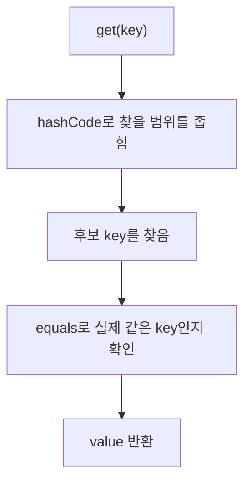

## Map과 HashMap의 관계

`Map`은 key와 value를 짝지어 저장하는 규칙이고, `HashMap`은 해시를 이용해 그 규칙을 구현한
클래스다.

```java
Map<String, String> products = new HashMap<>();
```

```text
Map     → key와 value를 저장하고 조회하는 규칙
HashMap → 그 규칙을 해시 방식으로 구현한 클래스
```

## HashMap은 hashCode 다음에 equals를 사용한다

```java
Map<String, String> products = new HashMap<>();

products.put("A101", "노트");
products.put("B202", "연필");

String product = products.get("A101");
System.out.println(product); // 노트
```

개발자는 보통 `get()`만 호출한다. HashMap이 내부에서 key의 `hashCode()`와 `equals()`를 사용한다.



`hashCode()`는 객체를 찾는 데 사용하는 정수다. 정답을 확정하는 고유 번호는 아니다. 서로 다른
객체도 같은 해시 값을 가질 수 있으므로 마지막에는 `equals()`로 확인한다.

## equals와 hashCode의 계약

두 객체가 `equals()`상 같다면 `hashCode()` 결과도 반드시 같아야 한다.

```text
first.equals(second) == true
              │
              ▼
first.hashCode() == second.hashCode()
```

반대는 반드시 성립하지 않는다.

```text
hashCode가 같음
→ 같은 key일 수도 있음
→ 서로 다른 key의 해시 충돌일 수도 있음
→ equals로 다시 확인
```

## 계약을 깨면 값을 찾지 못할 수 있다

다음은 문제를 재현하기 위해 일부러 잘못 만든 예시다.

```java
final class BrokenProductKey {
    private final String code;
    private final int wrongHash;

    BrokenProductKey(String code, int wrongHash) {
        this.code = code;
        this.wrongHash = wrongHash;
    }

    @Override
    public boolean equals(Object other) {
        if (this == other) {
            return true;
        }
        if (!(other instanceof BrokenProductKey productKey)) {
            return false;
        }
        return code.equals(productKey.code);
    }

    @Override
    public int hashCode() {
        return wrongHash;
    }
}
```

두 객체는 코드가 같아서 `equals()` 결과가 `true`지만 서로 다른 해시를 반환한다.

```java
BrokenProductKey storedKey = new BrokenProductKey("A101", 100);
BrokenProductKey searchKey = new BrokenProductKey("A101", 205);

System.out.println(storedKey.equals(searchKey)); // true

Map<BrokenProductKey, String> products = new HashMap<>();
products.put(storedKey, "노트");

System.out.println(products.get(searchKey)); // null이 나올 수 있음
```

아래 위치 번호는 이해를 위한 가상의 값이다.

```text
저장할 때
storedKey → hashCode 100 → 검색 위치 4에 저장

조회할 때
searchKey → hashCode 205 → 검색 위치 5에서 찾음
                              │
                              ▼
                    저장 위치까지 가지 못함
```

`equals()`가 같은 key라고 말해도 `hashCode()`가 다른 위치를 안내하면 HashMap은 그 key를 찾지
못할 수 있다.

## record는 값 비교 코드를 만들어 준다

`record`는 별도 라이브러리가 아니라 Java의 타입 선언 문법이다. 구성 요소를 기준으로 생성자,
접근자, `equals()`, `hashCode()`, `toString()`을 자동으로 만든다.

`ProductKey.java`:

```java
package com.example.product.domain;

public record ProductKey(String code) {
}
```

일반 클래스처럼 생성해서 사용한다.

```java
ProductKey first = new ProductKey("A101");
ProductKey second = new ProductKey("A101");

System.out.println(first == second);      // false
System.out.println(first.equals(second)); // true
```

HashMap에서도 두 객체를 같은 key로 판단할 수 있다.

```java
Map<ProductKey, String> products = new HashMap<>();
products.put(new ProductKey("A101"), "노트");

String product = products.get(new ProductKey("A101"));
System.out.println(product); // 노트
```

```text
저장 key: ProductKey("A101")
조회 key: ProductKey("A101")
              │
              ▼
hashCode가 같아 같은 범위에서 찾음
              │
              ▼
equals도 true라 같은 key로 확정
              │
              ▼
"노트" 반환
```

## record는 역할에 맞는 폴더에 둔다

`record` 전용 폴더를 만들 필요는 없다. 데이터가 맡은 역할을 기준으로 둔다.

```text
product
├─ controller
│  ├─ ProductController.java
│  ├─ ProductCreateRequest.java   요청 데이터 record
│  └─ ProductResponse.java        응답 데이터 record
├─ service
│  └─ ProductService.java
└─ domain
   ├─ Product.java                상태와 동작이 있는 일반 class
   └─ ProductKey.java             값을 나타내는 record
```

패키지가 다르면 일반 클래스처럼 import한다. `record` 문법 자체를 import하지는 않는다.

```java
import com.example.product.domain.ProductKey;
```

<details>
<summary><b>🔍 일반 class와 record 중 무엇을 선택할까?</b></summary>

상품처럼 가격과 재고가 바뀌고 행동을 수행하는 핵심 객체에는 일반 클래스가 자연스럽다.

```java
class Product {
    private String name;
    private int price;
    private int stock;

    void decreaseStock(int quantity) {
        stock -= quantity;
    }
}
```

요청과 응답처럼 여러 값을 전달하거나, 여러 값을 묶어 하나의 값으로 표현할 때는 `record`를
고려할 수 있다.

```java
record ProductResponse(Long id, String name, int price) {
}

record ProductKey(Long productId, String optionCode) {
}
```

```text
상태가 계속 변하고 동작을 수행함 → 일반 class
여러 값을 묶어 전달함           → record 고려
구성 요소 자체가 값의 의미임     → record 고려
```

</details>

<details>
<summary><b>🔍 가변 객체를 HashMap key로 사용하면 왜 위험할까?</b></summary>

HashMap에 저장한 뒤 해시 계산에 사용되는 값을 변경하면 조회할 위치도 달라질 수 있다.

```text
저장할 때: code = "A101" → 위치 4
값 변경:   code = "B202"
조회할 때: code = "B202" → 위치 1에서 검색 → 찾지 못함
```

그래서 HashMap key에는 저장 후 값이 바뀌지 않는 `String`, `UUID`, 불변 클래스 또는 `record`가
안전하다. 현재 프로젝트도 상품별 점수를 저장하는 Map 등의 key로 `UUID`와 `String`을 주로
사용한다.

</details>

## 참고 자료

- [Java SE 21 Object.equals와 hashCode 계약](https://docs.oracle.com/en/java/javase/21/docs/api/java.base/java/lang/Object.html)
- [Java SE 21 Map](https://docs.oracle.com/en/java/javase/21/docs/api/java.base/java/util/Map.html)
- [Java SE 21 HashMap](https://docs.oracle.com/en/java/javase/21/docs/api/java.base/java/util/HashMap.html)
- [Java SE 21 Record](https://docs.oracle.com/en/java/javase/21/docs/api/java.base/java/lang/Record.html)
- [Java SE 27 Object](https://docs.oracle.com/en/java/javase/27/docs/api/java.base/java/lang/Object.html)
- [Java SE 27 Record](https://docs.oracle.com/en/java/javase/27/docs/api/java.base/java/lang/Record.html)
