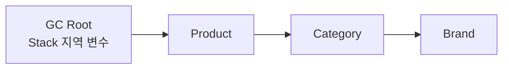
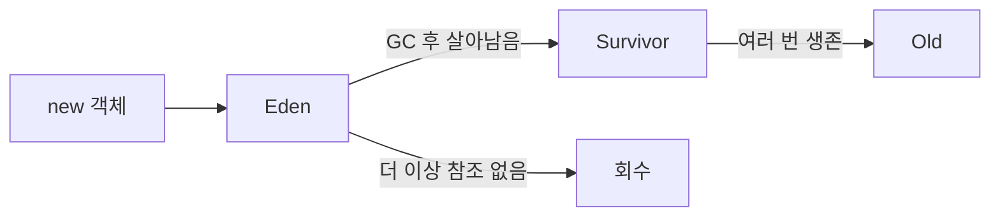

## 먼저, 객체는 어디에 있을까

Java 프로그램이 실행되면 여러 메모리 영역을 사용한다.

```text
JVM 프로세스
├─ Stack
│  └─ 각 스레드의 현재 메서드와 지역 변수
├─ Heap
│  └─ new로 만든 객체와 배열
└─ Metaspace
   └─ 클래스의 구조와 메서드 정보
```

| 영역 | 무엇이 들어가나 | 특징 |
|---|---|---|
| Stack | 메서드 실행 정보, 지역 변수, 객체를 가리키는 참조 | 스레드마다 따로 사용 |
| Heap | `new`로 만든 객체와 배열 | 여러 스레드가 함께 사용, GC 대상 |
| Metaspace | 클래스 메타데이터 | HotSpot JVM의 구현 영역, Heap과 별도 관리 |

```java
public void createProduct() {
    Product product = new Product("노트");
}
```

```text
Stack                         Heap
createProduct()               Product 객체
product ───────────────────▶  { name: "노트" }
```

`product`라는 지역 변수는 Stack에 있고, 실제 `Product` 객체는 Heap에 있다.

## GC는 객체 사이의 연결을 따라간다

GC는 단순히 오래된 객체나 변수가 `null`인 객체를 지우지 않는다. 프로그램이 계속 사용할 수 있는
시작점인 **GC Root**에서 출발해 객체를 따라간다.

```text
GC Root → 참조 → 객체 → 다른 객체
```

대표적인 GC Root는 다음과 같다.

- 실행 중인 스레드의 Stack에 있는 참조
- static 필드가 가리키는 객체
- JNI가 보관하는 참조
- JVM 내부에서 관리하는 참조



GC Root에서 따라갈 수 있는 객체를 **도달 가능(reachable)** 하다고 한다. 도달 가능한 객체는
아직 프로그램이 사용할 수 있으므로 회수하지 않는다.

## 도달할 수 없으면 회수 대상이다

```java
public void createProduct() {
    Product product = new Product("노트");
}
```

메서드가 끝나면 Stack의 `product` 참조가 사라진다.

```text
메서드 실행 중
Stack                    Heap
product ───────────────▶ Product("노트")

메서드 종료 후
Stack                    Heap
참조 없음                 Product("노트")
                         ↑
                         GC Root에서 도달할 수 없음
```

이 객체는 즉시 삭제되는 것이 아니라, 다음 GC에서 회수할 수 있는 후보가 된다.

```text
참조가 끊김 → 도달 불가능 → GC가 회수할 수 있음
```

핵심은 변수가 `null`인지가 아니라 **GC Root에서 해당 객체까지 연결된 경로가 남아 있는지**다.

## 순환 참조도 회수되는 이유

객체끼리 서로 참조하고 있어도 GC Root와 연결되지 않으면 회수할 수 있다.

```java
Product first = new Product("첫 번째");
Product second = new Product("두 번째");

first.related = second;
second.related = first;
```

```text
Product A ─────▶ Product B
    ▲                │
    └────────────────┘
```

`first`와 `second`를 가리키는 외부 참조까지 사라지면 다음과 같다.

```text
Product A ─────▶ Product B
    ▲                │
    └────────────────┘

둘이 서로 연결되어 있어도 GC Root에서 도달할 수 없음
→ 두 객체 모두 회수 가능
```

Java의 GC는 참조 횟수만 세는 방식이 아니라 **GC Root에서 출발하는 도달 가능성**을 기준으로 판단한다.

## Young과 Old는 객체의 나이를 나눈다

Heap 전체를 매번 검사하면 비용이 크다. HotSpot의 세대별 GC는 객체의 생존 기간에 따라 영역을
나누어 관리한다.

```text
Heap
├─ Young Generation
│  ├─ Eden
│  └─ Survivor
└─ Old Generation
```

대부분의 객체는 만들어진 뒤 오래 사용되지 않는다.

```text
요청 처리용 임시 객체 → 잠깐 사용 → Young에서 회수
오래 살아남은 객체   → 여러 GC에서 생존 → Old로 이동
```



Young 영역을 중심으로 수행하는 GC는 짧고 자주 일어나는 편이다. Old 영역까지 함께 정리하는
작업은 더 많은 객체와 참조를 확인하므로 비용이 커질 수 있다.

이 글의 세대 구분은 프로젝트가 사용하는 HotSpot Java 21의 기본 G1 GC를 이해하기 위한
단순화다. 실제 영역 구성과 단계는 GC 종류와 JVM 구현에 따라 달라질 수 있다.

## 프로젝트 Java 21과 최신 Java 27

현재 PromptHub 프로젝트의 `build.gradle`은 Java 21 toolchain을 지정한다.

```groovy
toolchain {
    languageVersion = JavaLanguageVersion.of(21)
}
```

따라서 프로젝트 코드를 읽을 때는 Java 21과 G1 GC 문서를 기준으로 삼는다.

최신 Java 27 공식 GC 문서에서도 기본 원리는 같다.

```text
GC Root에서 도달 가능 → 살아 있는 객체
GC Root에서 도달 불가능 → 회수 가능한 객체
```

다음 내용은 JVM 구현과 GC 종류에 따라 달라질 수 있다.

- Heap을 Young과 Old로 나누는 구체적인 방식
- GC가 애플리케이션을 멈추는 시간
- 객체를 Survivor나 Old로 이동시키는 조건
- 사용하지 않는 메모리를 OS에 반환하는 시점

즉, **객체의 도달 가능성은 JVM의 핵심 원리**이고, **세대 구성과 GC 단계는 특정 구현의 동작**이다.

## Stop-the-world는 무엇인가

GC가 객체를 이동하거나 참조를 수정하는 동안 애플리케이션 코드가 계속 객체를 변경하면 정리
기준이 흔들릴 수 있다. 그래서 일부 GC 단계에서는 애플리케이션 스레드를 잠시 멈춘다.

```text
애플리케이션 실행 → 잠시 멈춤 → GC 작업 → 다시 실행
                      ↑
                Stop-the-world
```

Stop-the-world는 JVM 전체가 꺼지는 것이 아니라, 정확히는 **애플리케이션 스레드가 잠시 멈추는
시간**이다.

G1 GC는 모든 작업을 한 번에 멈추는 방식만 사용하는 것은 아니다. 일부 표시는 애플리케이션과
동시에 수행하지만, Young GC와 객체 이동 같은 단계에는 Stop-the-world 구간이 있다.

GC의 목표는 쓰레기를 회수하면서도 애플리케이션이 멈추는 시간을 줄이는 것이다. 멈춤 시간이
길어지면 요청 응답 시간이 늘어날 수 있다.

## 기존 heap 글과의 관계

기존 글 `jvm/heap-memory-reclaim`은 다음 질문에 답한다.

```text
GC 후 heap 사용량과 OS 메모리는 왜 다르게 보일까?
재시작하면 왜 메모리가 줄어들까?
```

이번 글은 그보다 앞선 질문에 답한다.

```text
JVM은 어떤 객체를 쓰레기라고 판단할까?
서로 참조하는 객체도 회수될 수 있을까?
Young과 Old는 왜 나눌까?
```

```text
이번 글: 객체가 살아 있는지 판단하는 기준
        ↓
기존 글: 회수된 뒤 Heap과 OS 메모리에 보이는 변화
```

## 참고 자료

- [Java SE 21 JVM Specification: Run-Time Data Areas](https://docs.oracle.com/javase/specs/jvms/se21/html/jvms-2.html)
- [Java SE 21 HotSpot Garbage Collection Tuning Guide](https://docs.oracle.com/en/java/javase/21/gctuning/)
- [Java SE 21 G1 Garbage Collector](https://docs.oracle.com/en/java/javase/21/gctuning/garbage-first-g1-garbage-collector1.html)
- [Java SE 27 HotSpot Garbage Collection Tuning Guide](https://docs.oracle.com/en/java/javase/27/gctuning/)
