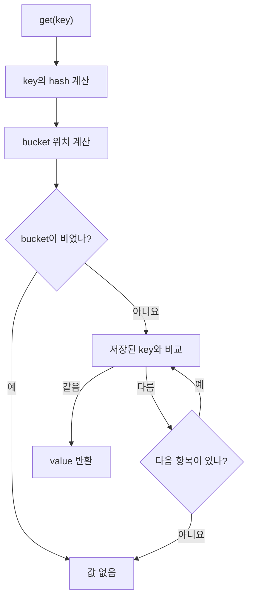

## HashMap을 보관함으로 생각해보자

HashMap을 여러 칸으로 나뉜 보관함이라고 생각해보자.

- `key`: 물건을 찾을 때 제시하는 번호표
- `value`: 보관할 물건
- `hash`: key로 계산한 위치 결정용 숫자
- `bucket`: 물건을 보관하는 한 칸

```text
key → 위치 계산 → bucket 선택 → key와 value 저장
```

다음 상품을 저장한다고 해보자.

```java
Map<Integer, String> products = new HashMap<>();
products.put(1, "노트");
products.put(5, "연필");
products.put(9, "가방");
```

설명을 위해 보관함이 4칸이고, 작은 양의 정수 key를 4로 나눈 나머지로 위치를 정한다고
단순화하자.

```text
key 1 → 나머지 1 → 1번 bucket
key 5 → 나머지 1 → 1번 bucket
key 9 → 나머지 1 → 1번 bucket

0번 bucket  [ 비어 있음 ]
1번 bucket  [1: 노트] → [5: 연필] → [9: 가방]
2번 bucket  [ 비어 있음 ]
3번 bucket  [ 비어 있음 ]
```

## 같은 bucket에 들어가는 것이 충돌이다

서로 다른 key가 같은 저장 위치를 가리키는 현상을 **해시 충돌**이라고 한다. 충돌이 발생해도
기존 항목을 바로 덮어쓰지 않는다. 같은 bucket 안에서 실제 key를 구별해 함께 저장한다.

<details>
<summary><b>🔍 같은 해시 값을 가지면 같은 값인가?</b></summary>

아니다. 해시는 key를 찾기 위한 위치 정보에 가깝다. 서로 다른 key도 같은 해시 값을 가질 수
있고, 서로 다른 해시가 같은 bucket을 가리킬 수도 있다.

```text
같은 key      → 같은 hashCode를 가져야 한다
같은 hashCode → 반드시 같은 key인 것은 아니다
```

value도 충돌 판단과 직접적인 관계가 없다. 서로 다른 key가 같은 value를 가져도 별개의 항목이다.

</details>

<details>
<summary><b>🔍 다른 bucket에 같은 key가 각각 저장될 수 있나?</b></summary>

정상적인 HashMap에서는 같은 key가 여러 bucket에 중복 저장되지 않는다. 같은 key를 다시
`put()`하면 새 항목을 추가하는 대신 기존 value를 바꾼다.

```java
products.put(1, "노트");
products.put(1, "볼펜");
```

최종 결과는 `1 → "볼펜"` 하나다. resize가 발생하면 항목이 새 bucket으로 이동할 수 있지만
이전 위치와 새 위치에 동시에 남지는 않는다.

key를 저장한 뒤 `hashCode()`에 영향을 주는 상태를 바꾸면 조회 위치가 달라질 수 있다. 그래서
HashMap의 key에는 불변 객체를 사용하는 것이 안전하다.

</details>

## 조회는 bucket을 찾은 뒤 key를 확인한다

`get(5)`의 흐름은 다음과 같다.

```text
get(5)
  ↓
위치를 계산해 1번 bucket으로 이동
  ↓
[1: 노트]  key가 다름
  ↓
[5: 연필]  key가 같음
  ↓
"연필" 반환
```

해시는 정답을 확정하지 않는다. 찾아볼 후보의 범위를 좁히고, 실제 key 비교가 대상을 확정한다.



## 평균 O(1)은 무슨 뜻일까

빅오 표기법은 정확히 몇 초가 걸리는지가 아니라, 데이터가 늘어날 때 해야 할 일이 얼마나
늘어나는지를 나타낸다.

목록에서 처음부터 찾으면 항목이 `n`개일 때 최대 `n`개를 확인할 수 있다. 이를 O(n)이라고 한다.

```text
[A] → [B] → [C] → [D] → ... → [찾는 값]
```

HashMap은 전체를 훑지 않고 계산한 bucket으로 이동한다. 데이터가 많아져도 잘 분산되어 있다면
그 bucket의 소수 후보만 확인한다.

<details>
<summary><b>🔍 평균 O(1)은 무슨 뜻인가?</b></summary>

데이터가 늘어나도 한 번의 조회에서 확인할 대상 수가 평균적으로 크게 늘어나지 않는다는 뜻이다.

O(1)은 정확히 한 번만 실행하거나 1초가 걸린다는 의미가 아니다. 해시가 여러 bucket에 고르게
분산되고 bucket 수도 데이터에 맞게 늘어난다는 조건에서 기대할 수 있는 평균적인 비용이다.

```text
잘 분산됨                 한 bucket에 몰림

0 [A]                    0 [ ]
1 [B] → [C]              1 [A] → [B] → [C] → [D]
2 [D]                    2 [ ]
3 [E]                    3 [ ]

소수 후보 확인: 평균 O(1)  여러 후보 확인: 연결 구조라면 O(n)
```

</details>

현대 OpenJDK HashMap은 충돌 항목이 많고 배열도 충분히 크면 연결 구조를 트리 구조로 바꿔
탐색 부담을 줄인다. 다만 모든 key에 대해 최악의 경우가 무조건 O(log n)이 된다고 단정할 수는
없다.

## resize는 bucket 수를 늘린다

HashMap은 항목이 많아지면 bucket 배열을 더 크게 만들고 기존 항목을 재배치한다.

```text
늘리기 전: 4칸              늘린 후: 8칸

0 [ ]                       0 [ ]
1 [1] → [5] → [9]           1 [1] → [9]
2 [2]                       2 [2]
3 [ ]                       3 [ ]
                            4 [ ]
                            5 [5]
                            6 [ ]
                            7 [ ]
```

공간이 늘면서 `5`는 다른 bucket으로 이동하지만 `1`과 `9`는 여전히 충돌한다. resize는 충돌을
줄일 공간을 마련하지, 모든 충돌을 없애지는 않는다.

한 번의 resize는 기존 항목을 재배치하므로 비싸다. 여러 삽입 전체에 이 비용을 나눠 보면 좋은
분산 조건에서 삽입을 분할상환 O(1)로 설명할 수 있다. `get()` 자체는 resize를 일으키지 않는다.

<details>
<summary><b>🔍 실제 HashMap의 bucket 계산식은 어떻게 생겼나?</b></summary>

OpenJDK 구현은 비트 연산으로 hash를 섞고 현재 배열 범위 안의 bucket 번호를 구한다.

```java
int hash = key.hashCode();
int spreadHash = hash ^ (hash >>> 16);
int bucketIndex = (tableLength - 1) & spreadHash;
```

이 식부터 외울 필요는 없다. `key → bucket 계산 → bucket 안에서 실제 key 비교` 흐름을 먼저
이해하면 된다. 이 계산은 `Map` 인터페이스 전체의 규칙이 아니라 OpenJDK HashMap의 구현 방법이다.

</details>

## 프로젝트에서는 어디에 쓰나

검색 순위를 합치는 코드의 `Map<UUID, Double> scores`는 상품 ID별 점수를 누적한다. 순위를
정렬할 때 `scores.get(id)`로 각 상품의 점수를 찾으므로 HashMap의 key 조회가 실제 흐름에
사용된다.

## 참고 자료

- [Java SE 21 HashMap](https://docs.oracle.com/en/java/javase/21/docs/api/java.base/java/util/HashMap.html)
- [Java SE 26 HashMap](https://docs.oracle.com/en/java/javase/26/docs/api/java.base/java/util/HashMap.html)
- [OpenJDK 26 HashMap source](https://github.com/openjdk/jdk/blob/jdk-26-ga/src/java.base/share/classes/java/util/HashMap.java)
