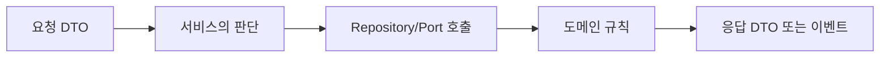

## 핵심

Java 코드를 읽을 때는 필드보다 먼저 **입력 → 판단 → 협력 객체 호출 → 반환** 순서를 찾는다. 예를 들어 서비스 메서드는 요청 DTO를 받고, repository에서 대상을 찾고, 도메인 객체에 규칙을 맡긴 뒤 응답을 만든다.



```java
Product product = repository.findById(id).orElseThrow(...);
product.changePrice(price);
return responseMapper.toResponse(product);
```

왼쪽 타입(`Product`)은 변수의 사용 가능한 메서드를 결정하고, `new`로 만들어진 실제 객체가 실행할 메서드를 결정한다.

<details>
<summary><b>읽기 체크리스트</b></summary>

1. 이 메서드는 누가 호출하는가?
2. 입력값의 타입과 null 가능성은 무엇인가?
3. 상태를 바꾸는 호출은 어디인가?
4. 실패하면 어떤 예외가 위로 올라가는가?
5. 마지막 결과는 DTO·이벤트·void 중 무엇인가?

</details>
