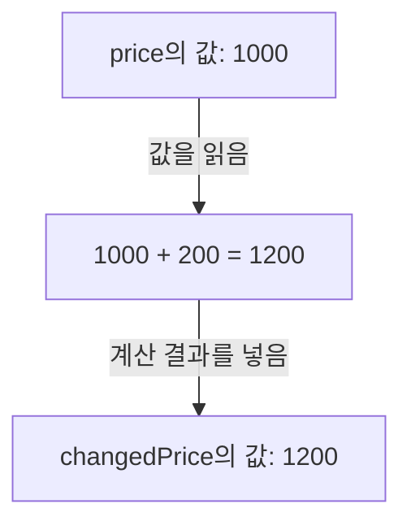

## 01 · 상품 가격을 200원 올리려고 한다

원래 가격은 1,000원이다. 가격을 올리는 코드를 읽을 때는 “무슨 뜻일까?”보다 **“이 줄 뒤에 얼마가 될까?”**를 먼저 묻는다.

변수는 값을 부르는 이름이고, 타입은 담을 수 있는 값의 종류다. Java 기본 타입 `int`는 정수를 담는다. 아래 두 줄은 학습용 계산이며 DB에 상품 가격을 저장하는 코드는 아니다.

```java
int price = 1000;
int changedPrice = price + 200;
```

## 02 · 첫 줄: price라는 이름에 1000을 넣는다

```text
실행 전: price 없음
실행 후: price → 1000
```

`=`는 같다는 비교가 아니라 오른쪽 값을 왼쪽 변수에 넣는 문법이다. `price`는 우리가 붙인 이름이다.

## 03 · 둘째 줄: 읽고 더한 결과를 새 이름에 넣는다


```mermaid
flowchart TD
  A["price의 값: 1000"] -->|"값을 읽음"| B["1000 + 200 = 1200"]
  B -->|"계산 결과를 넣음"| C["changedPrice의 값: 1200"]
```

결과는 `price = 1000`, `changedPrice = 1200`이다. 새 변수에 계산 결과를 넣었지 원래 `price`를 바꾼 것이 아니다. 가격 하나의 실행 모습을 나타낸 그림이며 실제 메모리 구조는 아니다.

## 04 · return은 계산한 값을 호출한 쪽에 돌려준다

메서드는 이름을 붙인 실행 묶음이다. `raisePrice(1000)`이라고 호출하면 입력 1000으로 아래 줄들을 실행하고 **1200을 반환**한다. 반환은 호출한 쪽에 결과를 돌려준다는 뜻이다.

<details>
<summary>같은 계산을 메서드로 읽어보기</summary>

```java
static int raisePrice(int price) {
    int changedPrice = price + 200;
    return changedPrice;
}
```

`static`은 이 예시의 메서드를 객체 생성 없이 호출하도록 하는 Java 문법이다. 괄호 안 `price`는 입력을 받는 변수다. 메서드 앞 `int`는 반환 결과가 정수라는 뜻이다.

Java 기본 문법만 사용하며 별도 라이브러리를 설치하지 않는다. 클래스 안에 두는 메서드 예시이지 이 부분만으로 독립 프로그램은 아니다.

</details>

값이 아니라 상품 **객체**를 가리키는 변수가 나오면 [기본형과 참조형](/study/jvm/java-primitive-and-reference-types), [값·참조·객체](/study/jvm/java-value-reference-and-object)에서 같은 방식으로 따라간다.

<details>
<summary>프로젝트 서비스 메서드는 무엇부터 읽을까?</summary>

**입력 → 판단 → 다른 객체 호출 → 반환**을 찾는다. 서비스 메서드가 요청 DTO를 받고, repository에서 상품을 찾고, 상품의 가격 변경 메서드를 호출한 뒤 응답을 만드는 경우다.

- DTO는 요청이나 응답에 담을 값을 모아 놓은 프로젝트 클래스다.
- repository는 저장소 조회를 맡는 객체다. Spring Data JPA를 사용하면 외부 라이브러리가 조회 구현을 제공할 수 있다.
- `Product`와 `changePrice`는 프로젝트가 만든 상품 타입과 메서드 이름의 예시다. Java 기본 제공 이름이 아니다.

왼쪽에 적힌 타입은 호출할 수 있는 메서드를 결정한다. 실제 객체의 타입은 오버라이딩된 메서드 중 무엇이 실행되는지에 영향을 준다.

읽을 때는 누가 호출하는지, 입력값과 null 가능성, 상태 변경, 실패 시 예외, 마지막 반환 결과를 확인한다. 객체 이름만 읽고 “DB도 바뀌었다”고 단정하지 않는다.

</details>

## 자기 말로 답해보기

`price`가 2000이면 둘째 줄 뒤 두 변수의 값은 각각 얼마일까?

<details>
<summary>답 확인</summary>

`price`는 2000, `changedPrice`는 2200이다. 원래 변수에 다시 넣지 않았으므로 원래 값은 바뀌지 않는다.

</details>

근거: [Java 언어 명세 — 변수](https://docs.oracle.com/javase/specs/jls/se21/html/jls-4.html#jls-4.12), [대입](https://docs.oracle.com/javase/specs/jls/se21/html/jls-15.html#jls-15.26), [return](https://docs.oracle.com/javase/specs/jls/se21/html/jls-14.html#jls-14.17). Java 21 기준으로 2026-10-08 확인.
