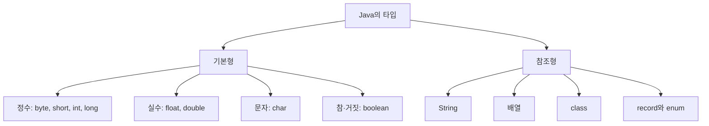

## Java 타입의 두 종류

Java에서 변수의 타입은 크게 **기본형**과 **참조형**으로 나뉜다.



## 기본형은 정해진 8개다

기본형 변수에는 숫자, 문자, 참·거짓 같은 값이 들어간다.

```java
int age = 20;
double height = 165.5;
char grade = 'A';
boolean active = true;
```

| 분류 | 기본형 | 예시 |
|---|---|---|
| 정수 | `byte`, `short`, `int`, `long` | `int age = 20;` |
| 실수 | `float`, `double` | `double price = 3.5;` |
| 문자 | `char` | `char grade = 'A';` |
| 참·거짓 | `boolean` | `boolean active = true;` |

기본형에는 객체의 기능인 메서드가 없다.

```java
int number = 10;
number.equals(10); // 컴파일 오류
```

## 나머지는 참조형이다

기본형 8개를 제외한 타입은 참조형이다. 참조형 변수는 생성된 객체를 가리킨다.

```java
String name = "지희";
int[] scores = {80, 90};
Product product = new Product();
ProductKey key = new ProductKey("A101");
```

`String`도 단순한 값처럼 보이지만 실제로는 클래스이며 객체다.

```text
기본형: int age = 20       → 변수에 20이라는 값이 들어감
참조형: String name = "지희" → name은 String 객체를 가리킴
```

참조형 변수에는 가리키는 객체가 없다는 뜻으로 `null`을 넣을 수 있다. 기본형에는 넣을 수 없다.

```java
String name = null; // 가능
int age = null;     // 컴파일 오류
```

<details>
<summary><b>🔍 Integer는 int와 무엇이 다른가?</b></summary>

`int`는 기본형이고 `Integer`는 객체다.

```java
int primitiveNumber = 10;
Integer objectNumber = 10;
```

Java 컬렉션은 객체를 담으므로 기본형 대신 대응하는 객체 타입을 사용한다.

```java
List<Integer> numbers = List.of(10, 20, 30);
// List<int> numbers; // 컴파일 오류
```

| 기본형 | 대응하는 객체 타입 |
|---|---|
| `int` | `Integer` |
| `long` | `Long` |
| `double` | `Double` |
| `boolean` | `Boolean` |
| `char` | `Character` |

</details>

## 참고 자료

- [Java SE 21 언어 명세: Types, Values, and Variables](https://docs.oracle.com/javase/specs/jls/se21/html/jls-4.html)
- [Java SE 27 언어 명세: Types, Values, and Variables](https://docs.oracle.com/javase/specs/jls/se27/html/jls-4.html)
