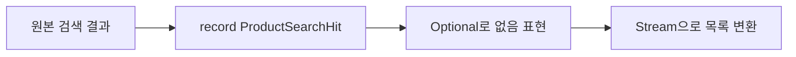

## 핵심

`record`는 값을 전달하는 작은 불변 타입에 적합하다. `ProductSearchHit`처럼 검색 결과 한 건을 표현할 때 필드와 생성 규칙을 한곳에 둔다.

`Optional`은 값이 없을 수 있음을 타입으로 드러낸다. `orElseThrow`는 “없으면 어떤 실패인가”를 호출부에서 읽게 한다.

Stream은 컬렉션을 변환·필터·수집하는 선언적 파이프라인이다. 다만 복잡한 분기나 부작용이 많으면 일반 반복문이 더 읽기 쉽다.

<b>주의할 점</b>

Optional을 entity 필드나 모든 매개변수에 무조건 사용하지 않는다. Stream 안에서 DB 저장·외부 호출 같은 부작용을 수행하지 않는다. 문법을 썼다는 사실보다 업무 흐름이 선명한지가 우선이다.

