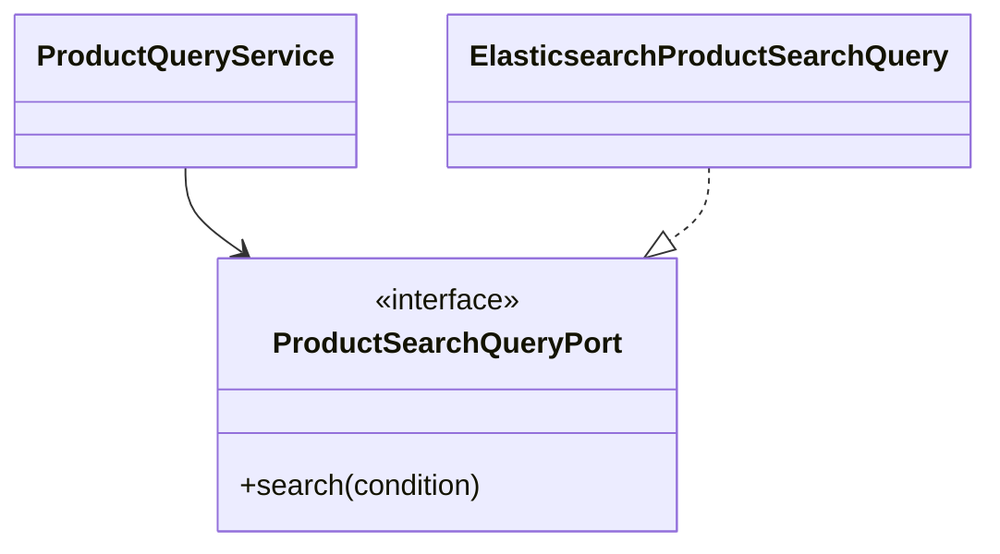

## 핵심

캡슐화는 필드를 private으로 만드는 데서 끝나지 않는다. 상태 변경을 도메인 메서드 안에 두어 잘못된 상태를 막는 것이다. 인터페이스는 호출자가 구현 클래스를 몰라도 되는 계약이다.



```java
ProductSearchQueryPort searchPort;
ProductSearchPage page = searchPort.search(condition);
```

호출자는 Elasticsearch 구현인지 다른 구현인지 알 필요가 없다. 이것이 다형성이다. 같은 `search` 호출이 실제 객체에 따라 다른 동작을 한다.

<details>
<summary><b>면접에서 기대하는 수준</b></summary>

“인터페이스는 다중 구현이 가능하다”에서 멈추지 말고, 왜 테스트 대역을 주입하거나 인프라 교체를 쉽게 하는지 설명할 수 있어야 한다. Oracle도 인터페이스를 구현 클래스가 지켜야 하는 컴파일 시점 계약으로 설명한다.

</details>
