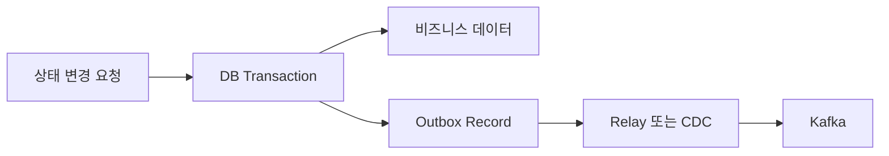

비동기 처리는 단순히 `@Async`를 붙이거나 Kafka에 메시지를 보내는 기술이 아니다. 호출한 서비스가 다른 작업의 완료를 기다리지 않아도 되도록 **실행 시점과 실패 책임을 분리하는 설계**다.

비동기로 바꾸면 요청 응답은 빨라질 수 있지만 새로운 문제가 생긴다.

- 실행하지 못한 작업은 어디에서 기다리는가?
- 애플리케이션이 종료되면 작업은 사라지는가?
- 같은 이벤트가 두 번 도착하면 어떻게 막는가?
- 계속 실패하는 이벤트는 어디에서 확인하는가?
- DB 저장은 성공했는데 이벤트 발행이 실패하면 어떻게 복구하는가?

이 장에서는 다음 순서로 답을 찾는다.


## 1. 동기와 비동기는 완료를 확인하는 방식이다

동기 처리에서는 호출자가 작업 완료를 확인한 후 다음 단계로 진행한다.

```text
order-service → payment-service에 결제 승인 요청
order-service ← 결제 승인 결과 수신
order-service → 승인 결과에 따라 주문 상태 변경
```

결제 승인처럼 지금 결과가 있어야 다음 상태를 결정할 수 있다면 동기 호출이 자연스럽다.

비동기 처리에서는 호출자가 다른 작업의 완료를 기다리지 않는다.

```text
order-service → ORDER_PAID 이벤트 발행
order-service → 자신의 요청 처리 종료

product-service → 나중에 판매량 반영
notification-service → 나중에 알림 생성
```

주문 서비스는 상품 서비스와 알림 서비스가 처리를 끝낼 때까지 기다리지 않는다. 대신 각 소비자가 자신의 실패와 재처리를 책임진다.

| 질문 | 동기 | 비동기 |
|---|---|---|
| 결과가 필요한 시점 | 지금 | 나중 |
| 실패 확인 | 응답에서 즉시 확인 | 상태·로그·이벤트로 별도 확인 |
| 대표 방식 | REST, gRPC | Kafka, 작업 큐 |

동기와 비동기는 어느 쪽이 더 좋은지가 아니라 **지금 결과가 필요한가**를 기준으로 선택한다.

## 2. 블로킹과 논블로킹은 실행 자원이 기다리는 방식이다

동기·비동기와 블로킹·논블로킹은 같은 분류가 아니다.

- 동기·비동기: 호출자가 작업 완료를 언제 확인하는가
- 블로킹·논블로킹: 결과를 기다리는 동안 현재 thread가 다른 일을 할 수 있는가

일반적인 JDBC 조회는 DB 응답이 올 때까지 실행 중인 thread가 기다리는 블로킹 작업이다.

```text
요청 thread
→ DB에 SELECT 전송
→ DB 응답을 기다림
→ 결과 수신
→ 다음 Java 코드 실행
```

이 JDBC 작업을 `@Async`로 옮겨도 JDBC가 논블로킹으로 바뀌는 것은 아니다. 요청 thread 대신 Executor의 worker thread가 DB 응답을 기다린다.

<details>
<summary><b>🔍 작업 큐와 Executor는 무엇인가?</b></summary>

작업 큐는 아직 실행하지 못한 작업이 기다리는 대기 줄이다.

카페에 비유하면 주문표가 작업이고, 주문표가 쌓이는 곳이 작업 큐이며, 음료를 만드는 직원이 worker thread다.

```text
호출자
→ 실행할 작업을 queue에 넣음
→ 사용 가능한 worker thread가 작업을 가져감
→ worker thread가 작업 실행
```

Executor는 이 작업 큐와 worker thread를 관리하는 실행 관리자다.

```java
executor.execute(() -> sendEmail());
```

“Executor에 작업을 제출한다”는 말은 `sendEmail`을 지금 호출한 thread에서 실행하지 않고 Executor의 대기 줄에 넣는다는 뜻이다. 사용 가능한 worker가 생기면 그 worker가 작업을 실행한다.

worker가 모두 사용 중이면 새 작업은 queue에서 기다린다. queue까지 가득 차면 설정된 거부 정책에 따라 작업 제출이 실패할 수 있다.

</details>

<details>
<summary><b>🔍 CompletableFuture와 CompletionStage는 어떤 역할인가?</b></summary>

`CompletableFuture`는 다른 thread에서 실행되는 작업의 “나중 결과표”다.

```java
CompletableFuture<Product> future =
    CompletableFuture.supplyAsync(
        () -> loadProduct(productId),
        productExecutor
    );
```

실행 순서는 다음과 같다.

1. `loadProduct` 작업을 `productExecutor`에 제출한다.
2. worker가 없으면 Executor queue에서 기다린다.
3. 호출자는 `Product` 대신 `CompletableFuture`를 먼저 받는다.
4. worker가 `loadProduct`를 실행한다.
5. 실행 결과나 예외가 `CompletableFuture`에 기록된다.

`CompletionStage`는 작업이 완료된 후 실행할 다음 단계를 연결하는 규칙이다.

```java
future
    .thenApply(Product::getName)
    .thenAccept(name -> log.info("상품명={}", name));
```

`CompletableFuture`는 결과를 보관하는 `Future` 역할과 다음 단계를 연결하는 `CompletionStage` 역할을 함께 구현한다.

[Java CompletableFuture 공식 문서](https://docs.oracle.com/en/java/javase/25/docs/api/java.base/java/util/concurrent/CompletableFuture.html)

</details>

<details>
<summary><b>🔍 블로킹 JDBC를 비동기로 실행하면 빨라지는가?</b></summary>

독립적인 조회를 동시에 실행하면 전체 대기 시간이 줄어들 수 있다. 하지만 JDBC 작업 자체는 여전히 DB 응답을 기다린다.

```text
요청 thread
→ 작업 제출 후 먼저 반환

Executor worker
→ DB connection 획득
→ SELECT 실행
→ DB 응답을 기다리며 블로킹
```

Executor worker가 50개여도 DB connection pool이 10개라면 동시에 DB 작업을 실행할 수 있는 수는 최대 10개다. 나머지 worker는 connection을 기다린다.

따라서 Executor worker 수, queue 크기, DB connection pool, SQL 실행 시간과 timeout을 함께 봐야 한다.

</details>

## 3. `@Async`와 Kafka는 작업을 보존하는 범위가 다르다

Spring의 `@Async`는 메서드 실행을 현재 thread에서 바로 수행하지 않고 `TaskExecutor`에 제출한다.

```java
@Service
public class EmailService {

    @Async("emailExecutor")
    public void sendEmail(Long userId) {
        emailClient.send(userId);
    }
}
```

다른 Spring Bean이 이 메서드를 호출하면 Spring proxy가 호출을 가로채 Executor에 작업을 넣고 호출자에게 먼저 반환한다.

```text
호출자
→ Spring proxy
→ emailExecutor에 작업 제출
→ 호출자에게 먼저 반환

emailExecutor worker
→ queue에서 작업을 가져감
→ sendEmail 실행
```

`@Async` 작업은 애플리케이션 메모리에 존재한다. 프로세스가 갑자기 종료되면 실행 대기 중인 작업이 사라질 수 있다.

Kafka record는 애플리케이션 밖의 Kafka Broker에 저장된다. Consumer가 종료돼도 보존 기간 안에는 다시 읽을 수 있다.

| 방식 | 작업이 기다리는 곳 | 프로세스 종료 시 | 주요 용도 |
|---|---|---|---|
| `@Async` | 애플리케이션의 Executor queue | 작업 유실 가능 | 한 프로세스 안의 보조 작업 |
| DB 작업 테이블 | DB row | 상태 기반 재실행 가능 | 오래 걸리는 업무·배치 |
| Kafka | Broker의 Partition Log | 보존 기간 내 재소비 가능 | 서비스 간 이벤트 전달 |

[Spring Task Execution 공식 문서](https://docs.spring.io/spring-framework/reference/integration/scheduling.html)

<details>
<summary><b>🔍 TaskExecutor에 작업을 제출한다는 것은 무슨 뜻인가?</b></summary>

`TaskExecutor`는 Spring이 제공하는 Executor 추상화다. 실제로는 `ThreadPoolTaskExecutor` 같은 구현체가 worker thread와 queue를 관리한다.

`@Async("emailExecutor")` 메서드가 호출되면 Spring은 원래 메서드를 현재 thread에서 직접 실행하지 않는다. 메서드 실행을 하나의 작업으로 만들어 `emailExecutor`에 전달한다.

호출자는 작업 완료를 기다리지 않고 먼저 반환받고, Executor worker가 나중에 실제 메서드를 실행한다.

`@Async`는 작업의 영구 저장, 실패 재시도, 중복 실행 방지와 처리 이력을 자동으로 제공하지 않는다.

</details>

<details>
<summary><b>🔍 Self-invocation에서는 왜 @Async가 적용되지 않나?</b></summary>

Self-invocation은 같은 객체가 자신의 다른 메서드를 직접 호출하는 경우다.

```java
@Service
public class OrderService {

    public void completeOrder() {
        sendEmail();
    }

    @Async("emailExecutor")
    public void sendEmail() {
        emailClient.send();
    }
}
```

Spring의 기본 `@Async`는 Bean 앞에 있는 proxy가 외부 호출을 가로채는 방식이다. 같은 객체 안에서 `sendEmail()`을 직접 호출하면 proxy를 거치지 않으므로 현재 thread에서 일반 메서드처럼 실행될 수 있다.

비동기 작업을 별도 Bean으로 분리하면 proxy를 거치는 호출 경계가 명확해진다.

같은 proxy 방식을 사용하는 `@Transactional`, `@Cacheable`, `@Retryable` 등에서도 비슷한 문제가 발생할 수 있다.

</details>

## 4. 이벤트는 발생한 사실을 전달한다

이벤트는 보통 이미 발생한 상태 변경을 과거형으로 표현한다.

```text
ORDER_CREATED
PAYMENT_APPROVED
ORDER_PAID
```

생산자는 “주문 결제가 완료됐다”는 사실을 발행한다. 상품 서비스는 판매량을 반영하고, 알림 서비스는 구매 완료 알림을 만든다.

이벤트에는 추적과 중복 방지에 필요한 정보를 담는다.

```text
eventId
eventType
occurredAt
aggregateId
schemaVersion
payload
```

생산자가 특정 소비자의 내부 작업까지 명령하면 서비스 간 결합도가 다시 높아진다. 생산자는 사실을 발행하고 각 소비자가 자신의 책임에 맞게 반응한다.

<details>
<summary><b>🔍 Broker, Topic, Partition, Record와 Partition Log는 무엇인가?</b></summary>

Broker는 Kafka 서버 한 대를 뜻한다. 여러 Broker가 모여 Kafka Cluster를 구성한다.

Topic은 이벤트 종류를 구분하는 논리적인 저장 공간이다.

```text
order-events
payment-events
product-events
```

Topic은 여러 Partition으로 나뉜다.

```text
order-events
├─ partition 0
├─ partition 1
└─ partition 2
```

Record는 Kafka에 저장된 이벤트 한 건이다. 각 Partition에는 Record가 발생 순서대로 뒤에 추가된다.

```text
partition 0

offset 0: ORDER_CREATED
offset 1: ORDER_PAID
offset 2: ORDER_REFUNDED
```

이렇게 Partition 안에 Record가 순서대로 쌓인 저장 구조를 Partition Log라고 한다.

Offset은 Partition 안에서 Record가 있는 위치 번호다. 다른 Partition의 Offset과 직접 비교하지 않는다.

</details>

## 5. 비동기 시스템에는 최종적 일관성이 필요하다

여러 서비스의 데이터가 즉시 동시에 변경되지 않고 이벤트 처리가 끝난 후 의도한 상태로 맞춰지는 방식을 최종적 일관성이라고 한다.

```text
10:00:00 order-service
주문 상태를 PAID로 변경

10:00:01 Kafka
ORDER_PAID 이벤트 전달

10:00:02 product-service
판매량 +1

10:00:03 notification-service
구매 완료 알림 생성
```

`10:00:00`에는 주문만 결제 완료이고 판매량과 알림은 아직 반영되지 않았다. 정상적으로 이벤트가 처리되면 잠시 후 모든 서비스가 의도한 상태로 수렴한다.

최종적 일관성을 사용하려면 다음 조건이 필요하다.

- 허용 가능한 반영 지연 시간
- 실패 시 재시도 방법
- 계속 실패한 Record의 보관 위치
- 지연과 실패를 발견할 Metric
- 운영자의 재처리 방법

<details>
<summary><b>🔍 최종적 일관성은 데이터가 잠시 틀려도 괜찮다는 뜻인가?</b></summary>

업무에서 허용한 중간 상태가 존재할 수 있다는 뜻이지, 데이터 누락을 방치해도 된다는 뜻은 아니다.

판매량 반영이 1~2초 늦는 것은 허용할 수 있다. 하지만 이벤트가 사라져 판매량이 영원히 반영되지 않는 것은 최종적 일관성이 아니라 장애다.

결제처럼 즉시 확정해야 하는 값과 통계·알림처럼 조금 늦게 반영돼도 되는 값을 구분해야 한다. 업무마다 허용 지연과 복구 기준이 다르다.

</details>

## 6. 중복 메시지는 멱등성으로 방어한다

Kafka Consumer가 Record를 처리한 후 Offset을 저장하기 전에 종료되면 같은 Record를 다시 받을 수 있다.

```text
ORDER_PAID 소비
→ 판매량 +1 성공
→ Consumer 종료
→ Offset 저장 실패
→ Consumer 재시작
→ 같은 ORDER_PAID 다시 소비
```

멱등성은 같은 작업을 여러 번 실행해도 최종 결과가 한 번 실행한 것과 같은 성질이다.

```text
상태를 PAID로 변경

1번 실행 → PAID
3번 실행 → PAID
```

반면 판매량 증가는 멱등하지 않다.

```text
판매량 +1

1번 실행 → 11
3번 실행 → 13
```

비멱등 작업은 Event ID 처리 이력을 저장해 중복 반영을 막을 수 있다.

```text
eventId = event-123

첫 번째 처리
→ 처리 이력 없음
→ 판매량 +1
→ event-123 처리 완료 저장

두 번째 처리
→ 처리 이력 있음
→ 비즈니스 작업 없이 종료
```

이 처리 이력을 Inbox라고 부를 수 있다. 프로젝트의 실제 선택은 [Outbox·Inbox는 짝이 아니다](/study/msa/outbox-inbox-when-needed)에서 확인한다.

<details>
<summary><b>🔍 Offset Commit은 무엇인가?</b></summary>

Consumer가 자신이 Partition의 어디까지 처리했는지를 Kafka에 저장하는 것이 Offset Commit이다.

```text
offset 0: 처리 완료
offset 1: 처리 완료
offset 2: 다음에 처리할 Record

committed offset: 2
```

Consumer가 재시작하면 committed offset을 확인하고 해당 위치부터 다시 읽는다.

DB 반영 후 Offset Commit 전에 종료되면 같은 Record를 다시 읽을 수 있으므로 중복 처리가 발생할 수 있다.

반대로 비즈니스 처리 전에 Offset을 Commit하면 Consumer가 종료됐을 때 처리하지 못한 Record를 건너뛸 수 있다.

프로젝트에서는 `enable.auto.commit`, Spring Kafka `AckMode`, DB Transaction과 Commit 시점을 함께 확인해야 한다.

[Apache Kafka Delivery Semantics](https://kafka.apache.org/40/design/design/#message-delivery-semantics)

</details>

<details>
<summary><b>🔍 상태를 PAID로 변경하면 전체 작업도 항상 멱등한가?</b></summary>

상태 변경만 보면 멱등하지만 같은 메서드 안에 다른 부작용이 있으면 전체 작업은 멱등하지 않을 수 있다.

```text
주문 상태를 PAID로 변경
결제 Row INSERT
ORDER_PAID 이벤트 발행
이메일 전송
```

상태는 여러 번 PAID로 변경해도 같지만 결제 Row, 이벤트와 이메일은 중복될 수 있다.

멱등성을 판단할 때 대표 상태 하나만 보지 말고 Transaction 안에서 실행되는 모든 부작용을 확인해야 한다.

</details>

## 7. Retry는 다시 성공할 가능성이 있는 실패에만 적용한다

Retry는 실패한 작업을 다시 시도하는 것이다. 모든 오류를 무조건 다시 시도하지 않는다.

| 실패 | 처리 예시 |
|---|---|
| 일시적인 Network Timeout | 제한된 Retry |
| DB Connection 일시 부족 | Backoff 후 Retry |
| 외부 서비스의 일시적 `5xx` | 제한된 Retry |
| JSON 형식 손상 | 즉시 DLT |
| 필수 `orderId` 누락 | 즉시 DLT |
| 지원하지 않는 Schema Version | 즉시 DLT 또는 별도 격리 |
| 이미 처리한 Event ID | 성공으로 간주하고 종료 |

Retry에는 최대 횟수, 시도 사이의 대기 시간, 다시 시도할 예외와 최종 실패 처리 방법이 필요하다.

Backoff는 재시도 사이에 기다리는 시간이다. 장애가 회복되기 전에 즉시 반복 호출해 외부 시스템을 더 압박하지 않게 한다.

<details>
<summary><b>🔍 Retry는 Kafka가 기본으로 제공하는 기능인가?</b></summary>

무엇을 다시 시도하는지 구분해야 한다.

Producer Retry는 Producer가 Record를 Broker로 보내다가 일시적인 Network 오류를 만났을 때 다시 전송하는 기능이다.

```text
Producer
→ Broker 전송 실패
→ 잠시 대기
→ 다시 전송
```

Consumer Retry는 Consumer가 Record를 정상적으로 받았지만 DB Update나 외부 API 호출 같은 비즈니스 처리에 실패한 경우다.

```text
Consumer가 ORDER_PAID 수신
→ DB Update 실패
→ 비즈니스 처리 재시도
```

Kafka Broker는 Consumer의 Java 메서드와 DB Transaction을 알지 못한다. 따라서 Consumer의 비즈니스 로직을 자동으로 다시 실행해주지는 않는다.

Spring Kafka의 Error Handler나 `@RetryableTopic`을 이용해 Consumer Retry를 구성한다.

</details>

## 8. DLT는 처리하지 못한 Record를 격리한다

DLT는 Dead Letter Topic의 약자다. Retry를 모두 소진했거나 처음부터 다시 시도해도 성공할 수 없는 Record를 정상 처리 흐름에서 분리해 저장한다.

```text
정상 Record
→ 원래 Consumer가 계속 처리

문제 Record
→ DLT로 이동
→ 원인 분석과 재처리 대상
```

필수 `orderId`가 없는 Record는 DB 장애가 회복되어도 처리할 수 없다. 이런 Record는 반복 Retry하지 않고 즉시 DLT로 보낼 수 있다.

DLT에 보냈다는 사실만으로 업무가 복구되지는 않는다. 원인을 수정하고 안전하게 다시 처리하는 운영 절차가 필요하다.

<details>
<summary><b>🔍 DLT Record는 어디에 저장되며 어떻게 확인하나?</b></summary>

DLT를 설정했다면 실패 Record는 Kafka의 별도 Topic에 저장된다.

```text
원본 Topic: order-events
DLT Topic: order-events-dlt
```

실제 이름은 설정에 따라 달라질 수 있다. 프로젝트에서 다음 항목을 확인한다.

- `@RetryableTopic`
- `dltTopicSuffix`
- `retryTopicSuffix`
- `DeadLetterPublishingRecoverer`
- 실패 종류에 따라 목적지를 고르는 Resolver
- 실제 Kafka Topic 목록

DLT도 일반 Kafka Topic이므로 Broker의 Partition Log에 저장되고 해당 Topic의 Retention 설정을 따른다.

</details>

<details>
<summary><b>🔍 격리된 Record는 이후 어떻게 처리하나?</b></summary>

일반적인 처리 순서는 다음과 같다.

1. DLT 유입 알림을 확인한다.
2. 원본 Topic·Partition·Offset을 확인한다.
3. Event ID, Payload와 예외를 확인한다.
4. 코드·데이터·외부 시스템 중 원인을 찾는다.
5. 원인을 수정한다.
6. 재처리 가능한 Record인지 판단한다.
7. 전용 재처리 기능으로 다시 발행한다.
8. 처리 성공과 중복 반영 여부를 확인한다.
9. 재처리 이력을 기록한다.

DLT Record를 무조건 원본 Topic으로 자동 반환하면 수정되지 않은 Record가 계속 실패하는 무한 반복이 생길 수 있다.

DLT에는 Event ID, 원본 위치, 예외, 시도 횟수와 실패 시각을 남기되 개인정보와 비밀값은 기록하지 않는다.

</details>

Spring Kafka의 Non-blocking Retry는 실패 Record를 Retry Topic으로 옮기고, 재시도 횟수를 소진하면 DLT로 보낼 수 있다. Record가 다른 Topic으로 이동하므로 원래의 처리 순서가 달라질 수 있다.

[Spring Kafka Retry Topic 공식 문서](https://docs.spring.io/spring-kafka/reference/retrytopic/how-the-pattern-works.html)

## 9. DB 저장과 Kafka 발행은 하나의 Transaction이 아니다

다음 코드는 DB와 Kafka라는 서로 다른 시스템에 차례로 쓰는 Dual Write다.

```java
orderRepository.save(order);
kafkaTemplate.send("order-events", event);
```

중간에 애플리케이션이 종료되면 불일치가 발생할 수 있다.

```text
DB Commit 성공
→ 애플리케이션 종료
→ Kafka 발행 실패
```

DB에는 결제 완료 주문이 있지만 하류 서비스가 받아야 할 이벤트는 사라진다.

Kafka를 먼저 발행해도 문제가 해결되지 않는다.

```text
Kafka 발행 성공
→ DB Commit 실패
```

Consumer는 실제로 확정되지 않은 주문 상태에 반응할 수 있다.

DB Transaction과 Kafka 발행 사이의 이 문제를 줄이기 위해 Outbox Pattern을 사용할 수 있다.

## 10. Outbox는 상태와 발행 정보를 같은 DB에 저장한다

Outbox Pattern에서는 비즈니스 상태와 발행할 이벤트를 같은 DB Transaction으로 저장한다.



```text
BEGIN

주문 상태를 PAID로 변경
Outbox에 ORDER_PAID INSERT

COMMIT
```

Transaction이 Rollback되면 주문 상태와 Outbox Record가 모두 저장되지 않는다. Commit되면 둘 다 저장된다.

애플리케이션이 Kafka 발행 전에 종료돼도 Outbox Record가 DB에 남아 있으므로 나중에 다시 발행할 수 있다.

Outbox는 발행 유실을 줄이지만 중복 발행 가능성을 없애지는 않는다.

```text
Kafka 발행 성공
→ Outbox 발행 완료 기록 전에 종료
→ 재시작 후 같은 Outbox 다시 발행
```

따라서 Consumer의 멱등 처리가 여전히 필요하다.

## 11. Relay·CDC가 전달하고 Reconciliation이 누락을 찾는다

Outbox Table에 Record를 저장하는 것만으로 Kafka에 전달되지는 않는다. Outbox Record를 읽어 Kafka에 보내는 전달자가 필요하다.

Polling Relay는 주기적으로 미발행 Outbox를 조회한다.

```text
Relay 실행
→ 미발행 Outbox 조회
→ Kafka 발행
→ 발행 성공 기록
```

CDC는 Change Data Capture의 약자다. Debezium 같은 도구가 DB 변경 로그에서 Outbox Insert를 감지해 Kafka로 전달한다.

```text
애플리케이션
→ 비즈니스 데이터와 Outbox 저장

DB 변경 로그
→ Debezium이 Outbox Insert 감지
→ Kafka로 전달
```

Reconciliation은 원본과 반영 결과를 비교해 누락과 불일치를 찾고 복구하는 작업이다.

```text
order-service의 결제 완료 주문: 100건
product-service에 반영된 주문: 99건

누락된 Order ID 발견
→ 판매량 재반영
```

Outbox와 Reconciliation의 역할은 다르다.

- Outbox: 실시간 이벤트 발행 유실을 줄인다.
- Reconciliation: 이미 발생한 누락과 불일치를 나중에 발견한다.

중요한 결제·정산 흐름에서는 Outbox를 실시간 보호 장치로 사용하면서 주기 Reconciliation을 마지막 안전망으로 둘 수 있다.

<details>
<summary><b>🔍 Polling Relay와 CDC는 어떻게 다른가?</b></summary>

Polling Relay는 애플리케이션이나 별도 Worker가 Outbox Table을 일정 주기로 직접 조회한다.

```text
5초마다 실행
→ published = false인 Outbox 조회
→ Kafka 발행
→ published = true로 변경
```

구현이 비교적 단순하지만 Polling 간격, 여러 서버의 동시 실행과 발행 완료 상태를 직접 관리해야 한다.

CDC는 DB Table을 반복 조회하지 않고 DB의 변경 로그를 읽는다. Debezium이 Outbox Insert를 감지하고 Kafka Connect를 통해 Kafka로 전달할 수 있다.

CDC는 Polling을 줄일 수 있지만 Debezium, Kafka Connect와 Connector 상태를 추가로 운영해야 한다.

[Debezium Outbox Event Router 공식 문서](https://debezium.io/documentation/reference/stable/transformations/outbox-event-router.html)

</details>

<details>
<summary><b>🔍 주기 Reconciliation은 무엇이며 어떤 데이터를 비교하나?</b></summary>

Reconciliation은 신뢰할 수 있는 원본과 하류 반영 결과를 Business Key 단위로 비교하는 작업이다. 문맥에 따라 대사 또는 재조정이라고 부른다.

예를 들어 주문 서비스가 결제 완료 주문의 원본이라면 다음 항목을 비교할 수 있다.

```text
원본
order-service의 PAID 주문 ID

비교 대상
product-service가 처리한 ORDER_PAID의 주문 ID
```

단순히 총합만 비교하면 누락 1건과 중복 1건이 같은 숫자로 상쇄될 수 있다. 가능하면 Order ID나 Event ID 단위로 비교한다.

Reconciliation 작업도 다시 실행될 수 있으므로 복구 연산은 멱등하게 만든다.

</details>

Outbox는 모든 이벤트에 적용하는 규칙이 아니다. 이벤트 유실 비용이 Outbox 저장·전달·정리·모니터링의 운영 비용보다 클 때 적용한다.

## 학습 완료 기준

이 장을 공부한 뒤에는 다음을 설명할 수 있어야 한다.

- 동기·비동기와 블로킹·논블로킹의 차이
- 작업 큐, Executor, `CompletableFuture`의 연결
- 블로킹 JDBC를 `@Async`로 실행해도 논블로킹이 아닌 이유
- `@Async`와 Kafka의 내구성 차이
- Self-invocation에서 `@Async`가 적용되지 않는 이유
- Broker, Topic, Partition, Record와 Offset의 관계
- 최종적 일관성과 영구적인 데이터 누락의 차이
- Offset Commit 전후에 중복과 유실이 발생하는 과정
- 멱등한 작업과 비멱등 작업의 차이
- Producer Retry와 Consumer Retry의 차이
- 즉시 DLT로 보내야 하는 오류와 재처리 절차
- DB와 Kafka의 Dual Write에서 이벤트가 유실되는 지점
- Outbox가 유실을 줄이지만 중복 발행은 막지 못하는 이유
- Relay와 CDC의 차이
- Reconciliation이 누락을 발견하는 방법

다음 흐름으로 설명한다.

> 주문 상태와 이벤트 발행을 서로 다른 시스템에 직접 기록하면 중간 장애로 이벤트가 유실될 수 있다. 발행 보장이 필요한 흐름에는 비즈니스 상태와 Outbox Record를 같은 DB Transaction으로 저장한다. Relay나 CDC가 이를 Kafka에 전달하고, 재발행으로 발생할 수 있는 중복은 Consumer의 Event ID 멱등 처리로 방어한다. 남을 수 있는 누락은 주기 Reconciliation으로 비교하고 복구한다.
