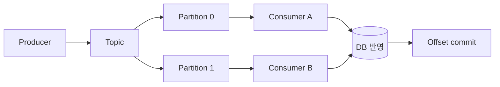
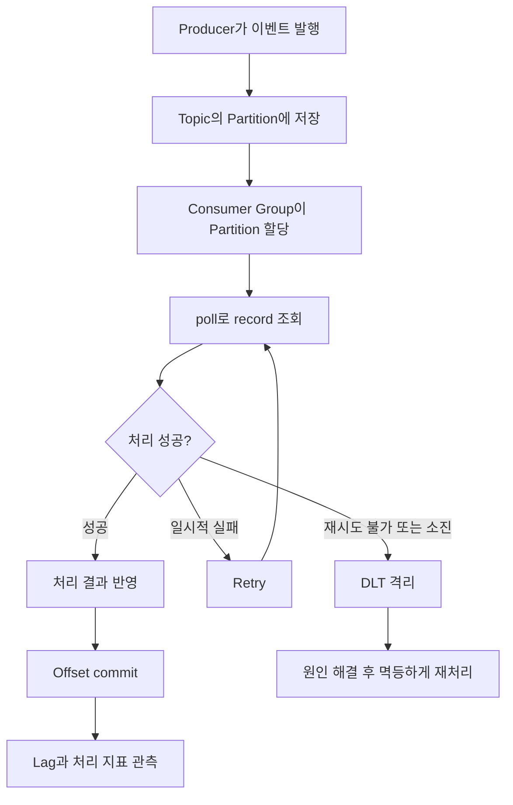

> 이 글은 2026년 9월 4일 기준 최신 Apache Kafka 4.3.1과 Spring Kafka 4.1.1 공식 문서를 바탕으로 작성했다. 실제 설정 이름과 지원 기능은 프로젝트에서 사용하는 버전에 맞춰 확인해야 한다.

Kafka를 이해하려면 단순히 “메시지를 주고받는 도구”라고 외우는 것보다 다음 흐름을 따라가는 것이 좋다.



1. Producer가 이벤트를 Topic에 보낸다.
2. Kafka는 이벤트를 Partition에 순서대로 저장한다.
3. Consumer Group이 Partition을 나누어 읽는다.
4. Consumer는 처리 완료 위치를 Offset으로 기록한다.
5. 처리 속도가 생산 속도를 따라가지 못하면 Consumer Lag이 증가한다.
6. 처리 실패 시 재시도하거나 DLT로 격리한다.
7. 같은 이벤트가 다시 들어와도 결과가 중복되지 않도록 멱등하게 처리한다.

## 1. Topic, Partition, Offset

`Topic`은 같은 종류의 이벤트를 모아두는 논리적인 이름이다. 예를 들어 주문 생성 이벤트는 `order-created`라는 Topic으로 발행할 수 있다.

하나의 Topic은 여러 `Partition`으로 나눌 수 있다. Partition은 이벤트가 실제로 순서대로 쌓이는 로그다.

각 이벤트에는 Partition 안에서의 위치를 나타내는 `Offset`이 붙는다. Offset은 전역 번호가 아니라 Partition마다 별도로 증가한다.

```text
order-created Topic

Partition 0: [offset 0] [offset 1] [offset 2]
Partition 1: [offset 0] [offset 1]
```

Kafka가 보장하는 순서는 Topic 전체의 순서가 아니라 **같은 Partition 안의 순서**다.

<details>
<summary><b>🔍 Partition log가 정확히 무엇일까?</b></summary>

Partition은 이벤트를 뒤에서부터 추가하는 append-only 로그에 가깝다.

```text
먼저 저장됨                              나중에 저장됨
[offset 0] → [offset 1] → [offset 2] → [offset 3]
```

Consumer가 이벤트를 읽었다고 해서 이벤트가 즉시 삭제되지는 않는다. Kafka는 보존 기간이나 용량 설정에 따라 이벤트를 일정 기간 유지한다.

따라서 Consumer는 처리한 이벤트를 삭제하는 대신 “어디까지 읽었는지”를 Offset으로 관리한다. 이 구조 덕분에 Offset을 이전 위치로 옮겨 과거 이벤트를 다시 읽을 수 있다.

</details>

## 2. Producer는 이벤트를 어느 Partition에 보낼까?

Producer가 이벤트를 발행하면 Kafka Producer는 해당 이벤트를 Topic의 Partition 중 하나에 보낸다.

이벤트에 key가 있다면 일반적으로 같은 key는 같은 Partition으로 전달된다. 주문 ID를 key로 사용하면 같은 주문에 관한 이벤트가 같은 Partition에 들어가므로 해당 주문의 이벤트 순서를 유지하기 쉽다.

```text
key = order-100 → Partition 0
key = order-200 → Partition 1
key = order-100 → Partition 0
```

하지만 Partition 수를 변경하면 key와 Partition의 대응 관계가 달라질 수 있다. 따라서 “같은 key는 영원히 같은 Partition에 들어간다”라고 가정해서는 안 된다.

<details>
<summary><b>🔍 이벤트에 key가 없으면 어떻게 될까?</b></summary>

key가 없으면 Producer의 Partition 선택 전략에 따라 이벤트가 여러 Partition에 분산된다.

처리량을 분산하는 데는 유리하지만, 서로 관련된 이벤트가 다른 Partition에 들어갈 수 있으므로 전체 순서를 보장할 수 없다.

순서가 중요한 기준이 있다면 그 기준을 key로 삼는다.

- 주문 흐름: `orderId`
- 결제 흐름: `paymentId`
- 회원별 알림: `userId`

모든 이벤트를 하나의 Partition에 넣으면 전체 순서를 유지할 수 있지만 병렬 처리 능력이 크게 줄어든다. 따라서 필요한 범위에서만 순서를 보장하도록 key를 선택해야 한다.

</details>

## 3. Consumer Group이 Partition을 나누어 읽는다

Consumer는 Topic에서 이벤트를 읽는 애플리케이션이다. 같은 `group.id`를 가진 Consumer들은 하나의 Consumer Group으로 동작한다.

한 Consumer Group 안에서 하나의 Partition은 동시에 한 Consumer에게만 할당된다.

```text
Partition 0 ── Consumer A
Partition 1 ── Consumer B
Partition 2 ── Consumer C
```

Consumer를 여러 개 실행하면 Partition을 나누어 처리할 수 있으므로 소비 처리량을 높일 수 있다.

다만 Consumer 수가 Partition 수보다 많으면 일부 Consumer는 할당받을 Partition이 없어 대기한다.

<details>
<summary><b>🔍 같은 이벤트를 여러 서비스가 각각 받아야 하면 어떻게 할까?</b></summary>

각 서비스가 서로 다른 Consumer Group을 사용하면 된다.

```text
order-created
 ├─ inventory-service-group → 재고 차감
 ├─ notification-service-group → 알림 발송
 └─ settlement-service-group → 정산 데이터 생성
```

각 Consumer Group은 독립적인 Offset을 가진다. 따라서 세 서비스는 같은 이벤트를 각각 한 번씩 소비할 수 있다.

반대로 같은 서비스의 인스턴스 여러 개가 같은 `group.id`를 사용하면 이벤트를 나누어 처리한다.

</details>

## 4. Rebalance는 Partition 담당자를 다시 정하는 과정이다

Consumer Group에 Consumer가 추가되거나 제거되면 Kafka는 Partition의 담당자를 다시 배정한다. 이 과정을 `Rebalance`라고 한다.

예를 들어 Consumer가 한 대 추가되면 기존 Consumer가 맡고 있던 Partition 일부가 새 Consumer로 이동할 수 있다.

```text
변경 전
Consumer A: Partition 0, 1
Consumer B: Partition 2, 3

변경 후
Consumer A: Partition 0, 1
Consumer B: Partition 2
Consumer C: Partition 3
```

Rebalance 자체는 정상적인 기능이다. 하지만 너무 자주 발생하면 소비가 잠시 중단되거나 같은 이벤트가 다시 처리될 가능성이 커질 수 있다.

<details>
<summary><b>🔍 Rebalance는 어떤 경우에 발생할까?</b></summary>

대표적인 원인은 다음과 같다.

- Consumer 인스턴스가 새로 실행됨
- Consumer가 정상 종료되거나 장애로 사라짐
- Consumer가 너무 오랫동안 `poll()`을 호출하지 않음
- Topic의 Partition 수가 변경됨
- Consumer가 구독하는 Topic 구성이 변경됨

처리 시간이 너무 길어 `max.poll.interval.ms` 안에 다음 `poll()`을 호출하지 못하면 Kafka는 해당 Consumer가 정상적으로 작업할 수 없다고 판단할 수 있다.

그 결과 Partition이 다른 Consumer로 이동하고, 늦게 처리를 끝낸 기존 Consumer의 Offset commit이 실패할 수 있다.

</details>

## 5. `poll()`은 이벤트를 가져오고 Consumer 상태를 유지한다

Kafka Consumer는 `poll()`을 호출해 이벤트를 가져온다.

```java
ConsumerRecords<String, OrderEvent> records =
        consumer.poll(Duration.ofSeconds(1));
```

`poll()`은 한 번에 반드시 이벤트 하나만 가져오는 것이 아니다. 설정과 현재 데이터 양에 따라 여러 record를 한 묶음으로 가져올 수 있다.

또한 `poll()`은 단순 조회 이상의 역할을 한다. Consumer가 Group에 참여하고 Partition 할당 상태를 유지하는 과정에도 관여한다.

<details>
<summary><b>🔍 이벤트 처리가 오래 걸리면 왜 문제가 될까?</b></summary>

다음과 같이 한 번 가져온 이벤트를 처리하는 데 너무 오래 걸릴 수 있다.

```text
poll()
  ↓
외부 API 호출
  ↓ 30초
DB 저장
  ↓ 20초
다음 poll()
```

다음 `poll()`까지의 시간이 `max.poll.interval.ms`를 넘으면 Kafka는 Consumer가 처리 능력을 잃었다고 판단할 수 있다. 그러면 Rebalance가 발생한다.

이 문제를 줄이려면 다음을 검토한다.

- 한 번에 가져오는 record 수 제한
- 이벤트 한 건의 처리 시간 단축
- 외부 API timeout 지정
- 오래 걸리는 작업을 별도 작업 흐름으로 분리
- 처리량에 맞춘 Partition과 Consumer 수 조정

Kafka Consumer 객체 자체는 thread-safe하지 않으므로 여러 스레드가 하나의 Consumer를 동시에 호출하도록 만들어서는 안 된다.

</details>

## 6. 현재 읽은 위치와 commit된 Offset은 다르다

Kafka Consumer에는 구분해야 할 두 위치가 있다.

- 현재 위치(position): 다음 `poll()`에서 읽을 Offset
- commit된 위치: 장애 후 다시 시작할 때 사용할 Offset

Consumer가 이벤트를 가져오면 현재 위치는 앞으로 이동한다. 하지만 Offset을 commit하지 않았다면 재시작 시 commit된 위치부터 다시 읽을 수 있다.

```text
가져온 위치:          offset 15
처리 완료 후 commit:  offset 13
재시작 위치:          offset 13
```

Offset commit은 “이 Offset의 이벤트를 저장한다”는 뜻이 아니라 **이 Consumer Group이 어디까지 처리했다고 볼 것인지 기록하는 것**이다.

<details>
<summary><b>🔍 commit할 때 왜 처리한 Offset의 다음 값을 저장할까?</b></summary>

commit된 Offset은 마지막으로 처리한 번호가 아니라 다음에 읽을 위치를 의미한다.

offset 10까지 처리를 완료했다면 일반적으로 commit할 값은 11이다.

```text
처리 완료: offset 8, 9, 10
commit:    offset 11
재시작:    offset 11부터 읽기
```

Kafka 공식 `KafkaConsumer` 문서에서도 commit할 Offset을 “다음에 읽을 record의 Offset”으로 설명한다.

</details>

<details>
<summary><b>🔍 자동 commit과 수동 commit은 무엇이 다를까?</b></summary>

자동 commit은 설정된 주기에 따라 Consumer가 읽은 위치를 자동으로 기록하는 방식이다.

처리는 끝나지 않았는데 Offset이 먼저 commit되면, 처리 중 장애가 발생했을 때 해당 이벤트가 다시 전달되지 않을 수 있다.

수동 commit은 애플리케이션이 처리를 끝낸 뒤 Offset을 기록하는 방식이다.

```text
이벤트 poll
  ↓
DB 반영
  ↓
처리 성공 확인
  ↓
Offset commit
```

수동 commit이라도 DB 반영 후 Offset commit 직전에 애플리케이션이 종료되면 같은 이벤트를 다시 받는다. 따라서 수동 commit은 중복 가능성을 제거하는 기능이 아니라 commit 시점을 더 명확하게 제어하는 기능이다.

Spring Kafka에서는 Container의 AckMode와 Listener 방식에 따라 commit 시점이 달라질 수 있으므로 프로젝트 설정을 함께 확인해야 한다.

</details>

## 7. Consumer Lag은 처리 지연을 나타낸다

Consumer Lag은 Consumer Group이 Kafka의 최신 이벤트를 얼마나 뒤따라가고 있는지 나타내는 값이다.

단순화하면 다음 관계로 이해할 수 있다.

```text
Consumer Lag = Partition의 Log End Offset - Consumer Group의 committed Offset
```

예를 들어 Partition의 다음 Offset이 1,000이고 Consumer Group의 committed Offset이 920이라면 Lag은 약 80이다.

Lag이 일시적으로 늘었다가 다시 감소한다면 순간적인 트래픽 증가일 수 있다. 계속 증가한다면 생산 속도를 소비 속도가 따라가지 못하는 상태일 가능성이 있다.

<details>
<summary><b>🔍 Lag이 증가하는 원인은 무엇일까?</b></summary>

대표적인 원인은 다음과 같다.

- Producer의 이벤트 생산량 증가
- Consumer 처리 속도 저하
- DB 쿼리 지연
- 외부 API 응답 지연
- 예외와 반복적인 재시도
- 잦은 Rebalance
- 부족한 Partition 또는 Consumer 수
- 너무 큰 batch 처리
- GC 정지나 CPU·메모리 부족

Lag만 보고 원인을 확정할 수는 없다. 다음 지표를 함께 확인해야 한다.

- record 처리 시간
- 처리 성공·실패 수
- commit 지연
- Rebalance 횟수와 시간
- 마지막 `poll()` 이후 경과 시간
- DB와 외부 API 응답 시간
- CPU와 메모리 사용량

Kafka는 `records-lag-max`, commit latency, rebalance 관련 지표 등을 제공한다. 운영 환경에서는 Prometheus와 Grafana 같은 도구로 추세를 확인할 수 있다.

이 절의 단순화 식은 committed Offset 기준이다. 클라이언트의 `records-lag-max`는 현재 읽기 위치 기준이며 측정 구간의 Partition 최대값이다. 둘을 같은 숫자로 취급하거나 업무 처리 성공량으로 읽지 않는다. [공식 Consumer 지표](https://kafka.apache.org/43/operations/monitoring/)

Lag가 늘 때 확인할 순서는 [주문 알림이 밀릴 때 Kafka에서 먼저 볼 것](/study/cs/kafka-lag-diagnosis)에서 살펴본다.

</details>

## 8. 전달 보장은 처리와 commit 순서에 따라 달라진다

Kafka 이벤트 처리에서 자주 사용하는 전달 의미는 다음 세 가지다.

| 방식 | 기본 흐름 | 결과 |
| --- | --- | --- |
| At-most-once | commit 후 처리 | 중복 가능성은 낮지만 유실 가능 |
| At-least-once | 처리 후 commit | 유실 가능성은 낮지만 중복 가능 |
| Exactly-once | 하나의 논리적 결과로 한 번만 반영 | 적용 범위와 조건 확인 필요 |

일반적인 백엔드 이벤트 처리에서는 유실을 줄이기 위해 at-least-once 방식을 선택하고, 중복은 멱등 처리로 방어하는 경우가 많다.

<details>
<summary><b>🔍 Kafka의 Exactly-once를 사용하면 DB 중복도 자동으로 해결될까?</b></summary>

그렇지 않다.

Kafka의 Exactly-once 기능은 Kafka 내부의 consume-process-produce 흐름에서 Transactional Producer와 관련 설정을 사용할 때 강한 보장을 제공한다.

하지만 Consumer가 다음과 같이 외부 DB를 변경하면 Kafka Transaction만으로 두 작업을 하나의 트랜잭션으로 묶을 수 없다.

```text
Kafka 이벤트 소비
  ↓
MySQL 주문 상태 변경
  ↓
Kafka Offset commit
```

DB 반영에는 성공했지만 Offset commit 전에 장애가 발생하면 이벤트가 다시 전달될 수 있다.

따라서 외부 DB나 API가 포함되면 멱등 처리, Inbox, 상태 조건 검증 같은 별도의 방어가 필요하다. “Exactly-once”라는 표현을 사용할 때는 어디부터 어디까지 한 번인지 범위를 함께 설명해야 한다.

</details>

## 9. 중복 소비는 정상적으로 발생할 수 있으므로 멱등하게 처리한다

At-least-once 방식에서는 같은 이벤트가 다시 전달될 수 있다.

```text
1. 이벤트 소비
2. DB 반영 성공
3. Offset commit 직전 장애
4. Consumer 재시작
5. 같은 이벤트 다시 소비
```

따라서 Consumer는 동일한 이벤트를 여러 번 처리해도 최종 결과가 한 번 처리한 것과 같도록 만들어야 한다.

예를 들어 이벤트마다 고유한 `eventId`를 두고 이미 처리한 ID인지 확인할 수 있다.

```text
eventId 확인
  ├─ 이미 처리됨 → 부수 효과 없이 종료
  └─ 처음 처리함 → 업무 처리 + eventId 저장
```

<details>
<summary><b>🔍 eventId만 조회한 뒤 처리하면 충분할까?</b></summary>

단순한 조회 후 저장만으로는 동시 처리 경쟁이 발생할 수 있다.

```text
Consumer A: eventId 없음 확인
Consumer B: eventId 없음 확인
Consumer A: 업무 처리
Consumer B: 업무 처리
```

따라서 처리 기록의 `eventId`에 Unique Constraint를 두고, 가능한 경우 업무 데이터 변경과 처리 기록 저장을 같은 DB 트랜잭션으로 묶는다.

멱등성은 DB 데이터만 확인해서는 안 된다. 다음과 같은 부수 효과도 고려해야 한다.

- 알림 중복 발송
- 포인트 중복 지급
- 외부 결제 API 중복 호출
- 다른 Kafka 이벤트 중복 발행

외부 시스템을 호출한다면 해당 시스템의 idempotency key 지원 여부나 별도의 호출 상태 관리가 필요하다.

</details>

## 10. Retry Topic과 DLT는 실패한 이벤트의 경로를 분리한다

일시적인 장애라면 잠시 후 다시 시도하면 성공할 수 있다.

```text
원본 Topic
   ↓ 실패
Retry Topic
   ↓ 일정 시간 후 재시도
성공 또는 DLT
```

Spring Kafka의 `@RetryableTopic`은 실패한 record를 Retry Topic으로 전달하고, 설정된 횟수만큼 처리한 뒤에도 실패하면 DLT로 보낼 수 있게 지원한다.

```java
@RetryableTopic(attempts = "4")
@KafkaListener(topics = "order-created")
public void consume(OrderCreatedEvent event) {
    orderProcessor.process(event);
}
```

여기서 `attempts = "4"`는 일반적으로 최초 처리까지 포함한 전체 시도 횟수다. 프로젝트에서 사용하는 Spring Kafka 버전의 동작을 공식 문서로 확인해야 한다.

<details>
<summary><b>🔍 Retry는 Kafka Broker가 자동으로 다시 호출해 주는 기능일까?</b></summary>

Kafka Broker는 이벤트를 Partition에 저장하고 Consumer가 Offset을 기준으로 읽도록 제공한다.

하지만 “3초 후 다시 시도하고, 세 번 실패하면 DLT로 보낸다” 같은 업무 재시도 정책을 Broker가 자동으로 결정하지는 않는다.

재시도는 Consumer 애플리케이션이나 Spring Kafka의 오류 처리 기능이 구성한다.

- 같은 Listener 안에서 즉시 다시 시도
- Retry Topic으로 보내 일정 시간 후 다시 소비
- 재시도하지 않고 즉시 DLT로 전송

어떤 방식을 사용할지는 예외 종류에 따라 달라진다. 네트워크 timeout은 재시도할 수 있지만, 필수 필드가 없는 잘못된 이벤트는 반복해도 성공하기 어려우므로 즉시 DLT로 보내는 편이 적절할 수 있다.

</details>

<details>
<summary><b>🔍 DLT로 격리된 이벤트는 어디에 있고 어떻게 처리할까?</b></summary>

DLT는 보통 별도의 Kafka Topic이다. 실패한 이벤트가 애플리케이션 메모리나 임시 파일에만 남는 것이 아니다.

예를 들면 다음과 같이 구성할 수 있다.

```text
order-created
order-created-retry
order-created-dlt
```

운영자는 DLT의 이벤트 수와 증가 추세를 모니터링한다. 이벤트를 재처리할 때는 다음 절차가 필요하다.

1. 실패 원인을 확인한다.
2. 코드, 데이터 또는 외부 시스템 문제를 해결한다.
3. 이벤트가 이미 일부 반영됐는지 확인한다.
4. 멱등 처리가 가능한 상태에서 원본 또는 재처리 Topic으로 보낸다.
5. 재처리 성공 여부를 기록한다.

원인을 해결하지 않고 DLT 전체를 그대로 재발행하면 같은 실패가 반복되거나 외부 요청이 중복될 수 있다.

Spring Kafka의 retry-topic 방식은 별도의 Consumer가 Retry Topic을 소비하므로 원본 Partition의 엄격한 처리 순서는 유지되지 않을 수 있다. 순서가 중요한 이벤트인지 먼저 확인해야 한다.

</details>

## 11. 통합 테스트와 이벤트 스키마 관리

Kafka Consumer 테스트는 메서드 호출만 검증하는 단위 테스트와 실제 Broker 흐름을 확인하는 통합 테스트를 구분한다.

Spring Kafka의 `@EmbeddedKafka`를 사용하면 테스트 과정에서 Kafka Broker를 실행해 다음 흐름을 검증할 수 있다.

```text
이벤트 발행
  ↓
실제 Topic 저장
  ↓
Listener 소비
  ↓
DB 또는 결과 상태 검증
```

다음 항목을 테스트 대상으로 삼을 수 있다.

- 정상 이벤트 처리
- 동일한 `eventId`의 중복 소비
- 처리 실패 후 재시도
- 재시도 소진 후 DLT 이동
- Offset commit 이전 장애
- 잘못된 이벤트 스키마
- 같은 key 이벤트의 처리 순서

이벤트는 서비스 사이의 계약이므로 클래스 위치와 스키마 변경도 관리해야 한다. 패키지명은 이벤트의 발행·수신 도메인이 드러나도록 정하고, 기존 Consumer를 깨뜨리는 변경은 피해야 한다.

<details>
<summary><b>🔍 Embedded Kafka는 Mock 테스트와 무엇이 다를까?</b></summary>

Mock 테스트는 Producer나 Consumer 인터페이스의 호출 여부를 빠르게 검증한다.

Embedded Kafka 통합 테스트는 실제 Topic과 Broker를 거치므로 다음과 같은 설정 문제도 찾을 수 있다.

- 직렬화·역직렬화 실패
- Topic 이름 오류
- Consumer Group 설정 오류
- Listener 연결 문제
- Retry Topic과 DLT 라우팅 문제

다만 운영 환경과 완전히 같은 Kafka 클러스터는 아니다. 실제 Broker 버전과 설정 차이까지 확인해야 한다면 Testcontainers 같은 방식으로 실제 Kafka 이미지를 실행하는 테스트도 고려할 수 있다.

</details>

<details>
<summary><b>🔍 이벤트 스키마를 변경할 때 무엇을 조심해야 할까?</b></summary>

이벤트 Producer와 Consumer는 동시에 배포되지 않을 수 있다. 따라서 새 Producer가 발행한 이벤트를 이전 Consumer도 처리할 수 있도록 호환성을 고려해야 한다.

비교적 안전한 변경은 다음과 같다.

- 선택 필드 추가
- Consumer에서 알 수 없는 필드 무시
- 새 필드에 기본 동작 정의

주의가 필요한 변경은 다음과 같다.

- 필드 삭제
- 필드 이름 변경
- 데이터 타입 변경
- 기존 필드의 의미 변경
- 필수 필드 추가

호환되지 않는 변경이 필요하면 이벤트 타입이나 명시적인 스키마 버전을 분리할 수 있다. 단순히 패키지에 `v1`, `v2`를 붙이는 것보다 실제 계약이 깨지는 변경인지 먼저 판단해야 한다.

</details>

## 전체 흐름 정리

Kafka Consumer 처리는 다음 흐름으로 설명한다.



핵심은 Offset commit만으로 중복 처리가 사라지지 않는다는 점이다.

처리 후 commit하는 방식은 이벤트 유실 가능성을 줄이지만, 처리 성공과 commit 사이에 장애가 발생하면 같은 이벤트를 다시 받을 수 있다. 따라서 Consumer는 중복 전달을 정상적인 상황으로 보고 멱등하게 구현해야 한다.

Consumer Lag이 증가하면 Consumer 수만 늘리기 전에 처리 시간, 외부 API, DB, Rebalance, commit 지연을 함께 확인한다. 실패한 이벤트는 Retry와 DLT로 분리하되, 재처리 전에 실패 원인과 기존 반영 여부를 확인한다.

## 공식 자료

- [Apache Kafka 4.3.1 Downloads](https://kafka.apache.org/community/downloads/)
- [Apache Kafka 4.3 KafkaConsumer API](https://kafka.apache.org/43/javadoc/org/apache/kafka/clients/consumer/KafkaConsumer.html)
- [Apache Kafka Consumer Configuration](https://kafka.apache.org/43/generated/consumer_config.html)
- [Apache Kafka Monitoring](https://kafka.apache.org/43/operations/monitoring/)
- [Apache Kafka Consumer Group Operations](https://kafka.apache.org/43/operations/basic-kafka-operations/)
- [Spring Kafka Retry Topic Configuration](https://docs.spring.io/spring-kafka/reference/retrytopic/retry-config.html)
- [Spring Kafka Retry Topic 동작 방식](https://docs.spring.io/spring-kafka/reference/retrytopic/how-the-pattern-works.html)
- [Spring Kafka 예외 처리](https://docs.spring.io/spring-kafka/reference/kafka/annotation-error-handling.html)
- [Spring Kafka EmbeddedKafka API](https://docs.spring.io/spring-kafka/docs/current/api/org/springframework/kafka/test/context/EmbeddedKafka.html)
