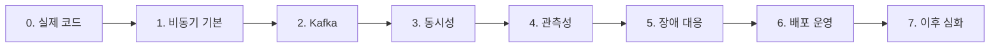

백엔드 공부는 기술 이름을 많이 외우는 순서보다 **현재 코드에서 문제를 발견하고, 해결에 필요한 원리를 역으로 학습하는 순서**가 효율적이다.

이 글은 모든 개념을 한 번에 설명하는 긴 교재가 아니다. 전체 학습 순서와 각 단계의 완료 기준을 고정하는 인덱스다. 이미 정리한 주제는 기존 Study를 연결하고, 부족한 주제는 후속 챕터로 보완한다.



## 0. 실제 코드에서 시작한다

가장 먼저 포트폴리오 코드와 바로 연결되는 문제를 처리한다.

- 공개·비공개 파일 조회 시 presigned URL을 새로 생성하는지 확인한다.
- DB에는 만료되는 URL이 아니라 S3 object key를 저장하는지 확인한다.
- `StorageClient` 주입 구조와 URL 만료·파일 없음·권한 오류 테스트를 점검한다.
- 반복되는 테스트 준비는 `@BeforeEach`로 모은다.
- order-service 테스트 마이그레이션과 Kafka 이벤트 리팩터링 PR #249를 현재 코드와 대조한다.
- gRPC 서비스명, proto package, Java package와 이벤트 패키지의 책임을 구분한다.

관련 글: [S3 presigned URL](/study/aws/s3-presigned-url), [Java 백엔드 테스트 기초](/study/testing/java-backend-testing-basics)

<details>
<summary><b>🔍 왜 presigned URL 대신 S3 key를 저장하나?</b></summary>

S3 object key는 파일을 식별하는 안정적인 값이다. presigned URL에는 서명과 만료 시간이 포함되므로 시간이 지나면 사용할 수 없다. DB에는 key를 저장하고, 조회 시점의 권한과 만료 정책으로 URL을 다시 만든다.

AWS도 presigned URL을 특정 object와 HTTP 동작에 대한 시간 제한 접근권으로 설명한다. 자세한 동작은 [Amazon S3 공식 문서](https://docs.aws.amazon.com/AmazonS3/latest/userguide/using-presigned-url.html)에서 확인한다.

</details>

## 1. 비동기 처리의 기본을 고정한다

동기·비동기와 블로킹·논블로킹을 먼저 구분한 뒤 이벤트 기반 아키텍처, 메시지 브로커, 최종적 일관성으로 확장한다. 실패·재시도·중복 메시지가 생기는 이유를 이해해야 멱등성, Retry, DLQ, Outbox Pattern을 설계할 수 있다.

`Stream`이라는 이름도 문맥에 따라 구분한다.

- Java Stream: 컬렉션 데이터 변환과 집계
- Kafka Streams: Kafka record의 지속적인 처리
- Reactive Streams: 비동기 흐름과 backpressure 계약
- `InputStream`·`OutputStream`: byte 입출력

현재 우선순위는 Java Stream과 Kafka 이벤트 흐름이다. 관련 글: [Modern Java와 Stream](/study/jvm/modern-java-records-optionals-streams), [서비스별 Outbox·Inbox](/study/msa/outbox-inbox-per-service)

## 2. Kafka의 처리 위치와 실패를 이해한다

Topic, Partition, Offset에서 시작해 Producer·Consumer, Consumer Group, 리밸런싱, `poll()`, offset commit과 Consumer Lag 순으로 학습한다.

```text
Consumer Lag ≈ partition의 latest offset - consumer group의 committed offset
```

Lag은 단순히 숫자가 크다는 뜻보다 생산 속도, 실제 처리 속도, commit 시점과 consumer 상태를 함께 해석해야 한다. 이후 At-most-once·At-least-once·Exactly-once, 중복 소비의 멱등 처리, Retry Topic·DLT와 Embedded Kafka 통합 테스트로 확장한다.

후속 챕터에서는 [Apache Kafka 설계](https://kafka.apache.org/40/design/design/), [Kafka 모니터링](https://kafka.apache.org/40/operations/monitoring/), [Spring Kafka Retry Topic](https://docs.spring.io/spring-kafka/reference/retrytopic/how-the-pattern-works.html)을 기준으로 현재 프로젝트 설정과 비교한다.

<details>
<summary><b>🔍 Exactly-once면 외부 DB 작업도 자동으로 한 번만 실행될까?</b></summary>

Kafka의 Exactly-once는 Kafka transaction 안에서 출력 record와 consumer offset을 원자적으로 처리하는 경계로 이해해야 한다. RDB 변경, 결제 API, 이메일 발송 같은 외부 부작용에는 unique constraint, 처리 event ID와 상태 전이 검증 같은 별도의 멱등 장치가 필요하다.

</details>

## 3. 동시성은 충돌을 재현한 뒤 도구를 고른다

트랜잭션과 격리 수준, Lost Update를 먼저 확인한 뒤 비관적 락, `SELECT ... FOR UPDATE`, 낙관적 락과 `@Version`, 충돌 예외 재시도 순으로 비교한다. Redis atomic counter와 distributed lock은 DB 안의 문제로 충분하지 않을 때 검토한다.

선착순 할인이나 재고 차감에서는 충돌 빈도와 재시도 비용을 측정해 선택 근거를 남긴다.

> 충돌 빈도가 낮아 낙관적 락을 적용했지만 선착순 요청에서 재시도가 증가해 원자적 조건부 갱신으로 변경했다.

관련 글: [격리 수준과 락](/study/database/isolation-levels-and-locking). 최신 DB 동작은 [PostgreSQL 트랜잭션 격리](https://www.postgresql.org/docs/current/transaction-iso.html)와 [명시적 락](https://www.postgresql.org/docs/current/explicit-locking.html)을 기준으로 확인한다.

## 4. 로그·메트릭·트레이스를 연결한다

세 신호는 경쟁 도구가 아니라 서로 다른 질문에 답한다.

| 신호 | 확인할 질문 | 대표 도구 |
|---|---|---|
| 로그 | 어떤 사건과 예외가 발생했나 | Elastic Stack, OpenSearch, Loki |
| 메트릭 | 오류율과 지연이 얼마나 변했나 | Prometheus, Grafana |
| 트레이스 | 요청이 어느 서비스를 거쳤나 | OpenTelemetry, APM |
| 알림 | 지금 대응해야 하는 상태인가 | Grafana Alerting 등 |

구조화 JSON 로그와 trace ID 전파부터 시작해 ELK 또는 Loki, Spring Actuator·Prometheus, Grafana, Kafka Lag 지표와 분산 추적으로 확장한다. 로그의 `userId`, `traceId`처럼 값의 종류가 계속 늘어나는 필드를 Loki label로 무작정 만들지 않는다.

후속 챕터의 기준 문서: [OpenTelemetry Signals](https://opentelemetry.io/docs/concepts/signals/), [Grafana Loki labels](https://grafana.com/docs/loki/latest/get-started/labels/), [Kibana Saved Objects](https://www.elastic.co/docs/extend/kibana/key-concepts/saved-objects)

## 5. 장애 전파를 목적별로 막는다

Timeout, Retry, Circuit Breaker, Fallback, Rate Limiting, Bulkhead를 다음 목적에 맞춰 구분한다.

| 패턴 | 보호 대상 |
|---|---|
| Timeout | 끝나지 않는 대기 |
| Retry | 회복 가능한 일시 실패 |
| Circuit Breaker | 계속 실패하는 외부 의존성 |
| Rate Limiting | 과도한 유입 요청 |
| Bulkhead | 공유 thread·connection 고갈 |

Retry는 멱등한 요청에 적용하거나 Idempotency-Key 같은 중복 방지 계약을 함께 사용한다. Rate Limiting에서는 Token Bucket과 `429 Too Many Requests`, 단일 인스턴스와 Redis 기반 분산 제한의 차이를 학습한다.

Java 구현 선택지는 [Resilience4j 공식 문서](https://resilience4j.readme.io/docs/getting-started)를 기준으로 검증한다.

## 6. 애플리케이션을 운영 단위로 확장한다

서비스별 Dockerfile에서 시작해 image와 container, Kubernetes Deployment·Service, ConfigMap·Secret, readiness·liveness probe, resource requests·limits와 OOMKilled 순으로 학습한다.

정산은 거래 원천, 대사, 일별 정산, 실패 건 관리, 재처리와 멱등성, Spring Batch Job·Step과 Kubernetes CronJob으로 별도 연결한다.

관련 글: [Kubernetes 클러스터 구조](/study/kubernetes/cluster-control-plane-worker), [Spring Batch chunk 처리](/study/spring/spring-batch-chunk-processing). 운영 동작은 [Kubernetes resource 관리](https://kubernetes.io/docs/concepts/configuration/manage-resources-containers/)와 [Pod lifecycle](https://kubernetes.io/docs/concepts/workloads/pods/pod-lifecycle/#container-probes)을 기준으로 확인한다.

## 7. 심화 기술은 현재 문제와 연결될 때 시작한다

WebFlux, Reactive Streams, backpressure, Netty, gRPC 심화, MongoDB와 S3 비교, Ollama·RAG, Go와 Rust는 현재 Spring·Kafka·운영 흐름을 설명할 수 있게 된 후 확장한다.

새 기술의 이름이 흥미롭다는 이유만으로 시작하지 않는다. 현재 프로젝트의 어떤 한계를 해결하는지, 기존 선택보다 무엇이 좋아지는지 설명할 수 있을 때 학습한다. `AX`처럼 문맥에 따라 뜻이 달라지는 용어는 정확한 의미부터 확인한다.

## 후속 챕터

이 인덱스를 기준으로 부족한 주제만 독립된 Study로 정리한다.

1. 동기·비동기부터 Outbox까지
2. Kafka offset, lag, 재처리와 멱등성
3. DB 락부터 Redis 원자 연산까지
4. 로그·메트릭·트레이스를 연결하는 관측성
5. Timeout, Retry와 Circuit Breaker의 적용 순서
6. Docker·Kubernetes와 JVM 운영
7. 정산 대사, 재처리와 Spring Batch
8. WebFlux·gRPC·RAG·Go·Rust의 학습 시점

각 상세 글은 해당 기술을 만든 프로젝트의 최신 공식 문서를 우선 사용한다. 버전별 동작이 달라지는 내용은 프로젝트가 실제 사용하는 버전과 공식 문서를 함께 대조한다.

## 완료 기준

각 단계마다 다음 질문에 답할 수 있어야 한다.

> 어떤 문제가 있었고 → 어떤 실패 조건을 확인했으며 → 왜 이 방법을 선택했고 → 어떤 테스트와 지표로 검증했는가

정의를 외우는 데서 끝나지 않고 PR, 실패 테스트, 동시 요청 결과, 대시보드와 배포 설정처럼 확인 가능한 결과물을 남긴다.
