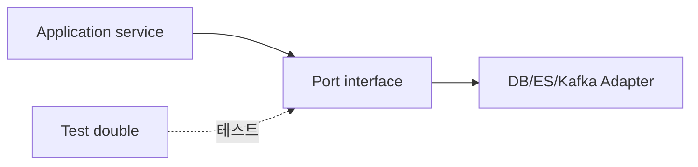

## 핵심

Spring DI는 클래스가 직접 `new`하지 않고 필요한 객체를 외부에서 받게 하는 방식이다. 덕분에 구현 교체와 테스트 대역 주입이 쉬워진다.



```java
class ProductSearchService {
    private final ProductSearchQueryPort queryPort;

    ProductSearchService(ProductSearchQueryPort queryPort) {
        this.queryPort = queryPort;
    }
}
```

코드를 읽을 때는 어노테이션보다 생성자 매개변수부터 본다. 그 목록이 이 클래스가 협력하는 외부 경계를 보여준다.

<details>
<summary><b>Port와 Adapter</b></summary>

Port는 “무엇을 할 수 있는가”를 말하는 인터페이스이고, Adapter는 DB·ES·Kafka 같은 기술을 연결하는 구현이다. application이 구체적인 ES client를 직접 알지 않게 만드는 것이 핵심이다.

</details>
