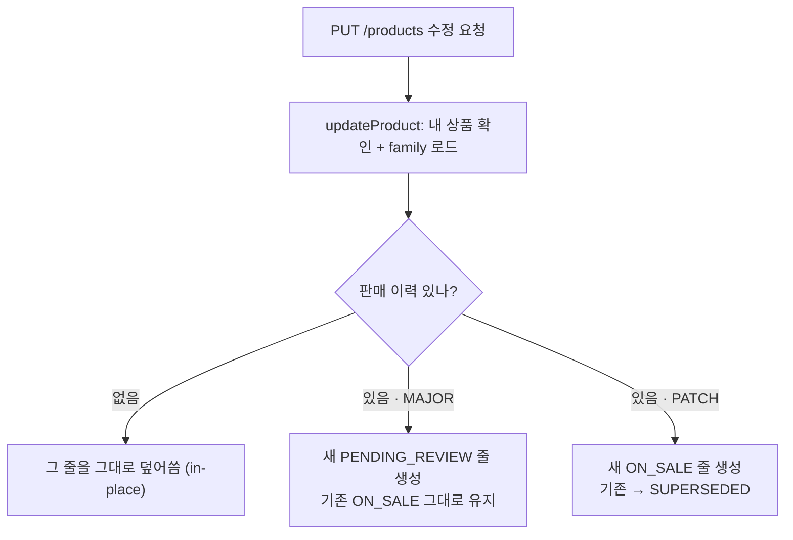
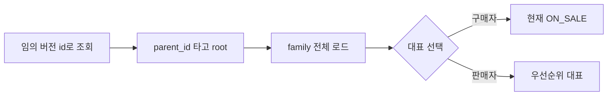
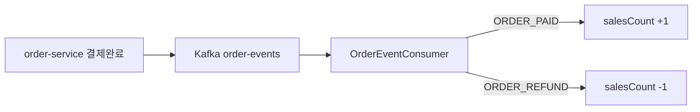

판매 중인 상품을 수정해도 관리자 승인 전까지 원래 콘텐츠가 살아있게 만든 기능이다. 요청이 컨트롤러에
들어와서 DB에 새 row가 쌓이기까지, 실제 코드를 한 줄씩 따라간다. Java·Spring을 처음 보는 사람 기준으로 썼다.

## 먼저, 3개의 단어

코드를 읽기 전에 이 셋만 알면 대부분 따라온다.

- **row-chain** — 한 상품 = 여러 줄(row). 예전엔 수정하면 그 줄을 덮어썼다. 이제는 버전마다 **새 줄**을
  만들고 `parent_id`로 원본을 가리킨다. 과거 버전이 물리적으로 남는다.
- **family** — 같은 `parent_id` 뿌리에 매달린 줄들의 묶음. "이 상품의 모든 버전"이 한 family다.
  그중 **대표 줄 1개**만 골라서 보여준다.
- **status** — 줄마다 상태가 있다. 판매중 `ON_SALE`, 검수대기 `PENDING_REVIEW`, 밀려난 옛버전 `SUPERSEDED` 등.

실제 DB에서는 이렇게 생겼다. 아래는 상품 하나를 크게 수정(MAJOR)한 직후의 `product` 테이블이다.

| id | parent_id | version | status |
|---|---|---|---|
| …015 | — (없음) | 1.0 | `ON_SALE` |
| 69aed4… | …015 | 2.0 | `PENDING_REVIEW` |

뿌리(root) …015 는 그대로 **판매 중**이고, 수정본 69aed4… 는 `parent_id`로 root를 가리키며 **검수 대기**다.
이게 row-chain의 전부다.

<details>
<summary><b>💡 왜 이렇게 했나 (원래 버그)</b></summary>

예전엔 수정이 원래 줄을 **그 자리에서 덮어썼다**. 그래서 판매자가 크게 수정하면, 관리자가 승인하기도 전에
판매 중이던 콘텐츠가 즉시 바뀌고 비공개가 됐다. 반려돼도 되돌릴 수 없었다. 줄을 쌓는 방식으로 바꾸니,
승인 전까지 원본이 살아있게 됐다.

</details>

## 여정 A — 판매자가 상품을 수정한다

가장 중요한 흐름이다. `PUT /api/v1/products/{productId}` 요청이 들어오면 상황에 따라 3갈래로 갈린다.



컨트롤러는 얇다. `@PutMapping`은 "이 URL로 PUT 요청이 오면 이 메서드를 실행하라"는 뜻이고,
요청에서 값만 꺼내 서비스에 넘긴다. 판단은 하지 않는다.

```java
@PutMapping("/{productId}")
public ApiResult<Void> updateProduct(
        @RequestHeader("X-User-Id") UUID sellerId,   // 게이트웨이가 넣어준 로그인 사용자
        @PathVariable UUID productId,                 // URL 안의 productId
        @Valid @RequestBody ProductUpdateRequest request) { // JSON 본문
    productSellerService.updateProduct(sellerId, productId, request);
    return ApiResult.success();
}
```

이 기능의 심장은 다음 메서드다.

```java
public void updateProduct(UUID sellerId, UUID productId, ProductUpdateRequest request) {
    Product anchor = getProductForSeller(sellerId, productId);          // ①
    boolean isMajor = "MAJOR".equalsIgnoreCase(request.versionType());  // ②

    UUID familyRootId = anchor.familyRootId();                          // ③
    ProductFamily family = ProductFamily.of(familyRootId,
        productRepository.findAllByFamilyRootIds(List.of(familyRootId)));// ④

    if (!family.hasEverBeenOnSale()) {                                  // ⑤
        anchor.update(...);          // 그 줄을 그대로 수정
        productRepository.save(anchor);
    } else {
        Product onSale = family.currentOnSale().orElseThrow(...);       // ⑥

        if (isMajor) {                                                  // ⑦
            if (family.pendingReview().isPresent()) throw ...;   // 이미 검수중이면 거부
            Product next = onSale.nextVersion(true, ...);          // 새 PENDING 버전
            productRepository.save(next);   // ← onSale은 안 건드림! 계속 판매중
        } else {                                                       // ⑧ PATCH
            Product next = onSale.nextVersion(false, ...);         // 새 ON_SALE 버전
            onSale.supersede();             // 옛 버전은 SUPERSEDED로
            productRepository.save(onSale);
            productRepository.save(next);
        }
    }
}
```

한 줄씩 뜯어보면:

1. **내 상품 꺼내기.** id로 상품을 찾고, 이 판매자 소유가 맞는지 확인한다. 아니면 예외. 여기서 꺼낸 줄을
   `anchor`(기준점)라 부른다 — 요청이 어떤 버전 id로 왔든 출발점이다.
2. **큰 수정인가?** 요청의 `versionType`이 `"MAJOR"`면 `true`. 대소문자 무시 비교.
3. **뿌리 찾기.** `familyRootId()`는 "이 줄에 `parent_id`가 있으면 그걸, 없으면 자기 id"를 돌려준다. 즉 family의 뿌리 id.
4. **family 통째로 로드.** 뿌리 id로 그 상품의 모든 버전 줄을 DB에서 불러와 `ProductFamily` 객체로 감싼다.
   이제 "현재 판매중은 뭐지?" 같은 질문을 이 객체에 물어볼 수 있다.
5. **갈래 1 — 판 적 없음.** 한 번도 `ON_SALE`/`SUPERSEDED`였던 적이 없으면(아직 검수 통과 전 초안 등),
   버전을 쌓을 필요가 없다. 그냥 그 줄을 덮어쓴다.
6. **현재 판매중 줄.** 판매 이력이 있으면, family에서 지금 `ON_SALE`인 줄을 꺼낸다. 아래 두 갈래의 기준.
7. **갈래 2 — MAJOR(큰 수정).** 판매중 줄을 **그대로 두고**, 그걸 바탕으로 새 `PENDING_REVIEW` 줄을 만들어
   저장한다. **판매중 콘텐츠는 안 바뀐다** — 이게 버그 수정의 핵심. 단, 이미 검수 대기중인 버전이 있으면 거부.
8. **갈래 3 — PATCH(작은 수정).** 검수 없이 바로 반영. 새 `ON_SALE` 줄을 만들고, 기존 판매중 줄은
   `supersede()`로 `SUPERSEDED`로 밀어낸다. 둘 다 저장 → 항상 판매중은 1개.

### 새 줄은 어떻게 만들어지나 — 도메인 메서드

`nextVersion()`·`supersede()`는 `Product` 엔티티 **안에** 있는 메서드다. "상태 변경은 setter가 아니라
의미 있는 메서드로"라는 이 프로젝트 규칙(DDD) 때문이다. 데이터를 바꾸는 규칙을 데이터 옆에 둔다.

```java
public UUID familyRootId() {
    return this.parentId != null ? this.parentId : this.id; // 부모 있으면 부모, 없으면 나
}

public Product nextVersion(boolean isMajor, ...) {
    Product next = new Product();
    next.id = UUID.randomUUID();          // 완전히 새 줄(새 id)
    next.parentId = this.familyRootId();  // 항상 뿌리를 가리킴 (체인이 깊어지지 않음)
    next.badge = null;                    // "신규" 뱃지 등은 물려받지 않음
    if (isMajor) {
        next.majorVersion = this.majorVersion + 1;  // 1.0 → 2.0
        next.status = ProductStatus.PENDING_REVIEW; // 검수 받아야 함
    } else {
        next.patchVersion = this.patchVersion + 1;  // 1.0 → 1.1
        next.status = ProductStatus.ON_SALE;        // 바로 판매
    }
    next.salesCount = 0;                  // 판매수·조회수는 새 줄이라 0에서 시작
    return next;
}

public void supersede() {
    if (this.status != ProductStatus.ON_SALE) throw new IllegalStateException(...);
    this.status = ProductStatus.SUPERSEDED; // 판매중 → 밀려남
}
```

여기서 꼭 볼 것: `next.parentId = this.familyRootId()` — 모든 새 버전은 **항상 뿌리**를 가리킨다.
v3를 만들 때 v2를 가리키는 게 아니라 여전히 root를 가리킨다. 그래서 family는 "뿌리 + 자식들"의 납작한
별 모양이고, `findAllByFamilyRootIds` 한 번으로 전부 불러올 수 있다.

## 여정 B — 관리자가 검수한다

MAJOR 수정으로 생긴 `PENDING_REVIEW` 버전을 관리자가 승인/반려한다. 승인 순간 "판매중 자리"가 교체된다.

```java
public void approveProduct(String role, UUID productId) {
    validateAdmin(role);                                    // 관리자 맞는지
    Product target = getProductInPendingReview(productId);  // 검수 대기 줄 꺼냄
    ProductFamily family = ProductFamily.of(target.familyRootId(),
        productRepository.findAllByFamilyRootIds(List.of(target.familyRootId())));

    family.currentOnSale().ifPresent(previous -> {   // ① 기존 판매중 → SUPERSEDED (있으면)
        previous.supersede();
        productRepository.save(previous);
    });
    target.approve();                                // ② 대상 → ON_SALE
    productRepository.save(target);
}
```

1. **기존 판매중을 먼저 밀어낸다.** `ON_SALE` → `SUPERSEDED`. 순서가 중요하다 — 먼저 밀어내고 나서
   승인해야 잠깐이라도 판매중이 2개가 되지 않는다.
2. **그다음 대상을 승인.** 검수 버전이 `ON_SALE`이 된다. 결과: family의 판매중은 여전히 정확히 1개,
   하지만 내용은 새 버전으로 교체됨.

되돌리기는 밀려났던 옛 버전을 **도로 살려낸다**.

```java
if (target.getStatus() == ProductStatus.ON_SALE) {   // 판매중인 걸 되돌릴 때만
    ProductFamily family = ProductFamily.of(familyRootId, ...);
    family.mostRecentSuperseded().ifPresent(paired -> { // 가장 최근 밀려난 짝
        paired.restoreFromSuperseded();                 // SUPERSEDED → ON_SALE 복원
        productRepository.save(paired);
    });
}
target.revertToPendingReview();                        // 대상은 다시 검수 대기로
```

이 흐름은 실제 서버에 띄워 테스트했다: 승인 → DB에서 옛 버전이 SUPERSEDED로 바뀜 확인 → 되돌리기 →
옛 버전이 다시 ON_SALE로 복원됨 확인. 전부 의도대로 동작했다.

## 여정 C — 누군가 상품을 조회한다

이제 읽기다. 문제: 사용자는 **아무 버전 id**로 조회할 수 있다(북마크, 오래된 링크). 그 id가 이미 밀려난
옛 버전일 수도 있다. 그래서 **resolve**가 필요하다.



```java
private Product getOnSaleProduct(UUID productId) {
    Product anchor = productRepository.findById(productId).orElseThrow(...); // ①
    UUID familyRootId = anchor.familyRootId();                              // ②
    List<Product> members = productRepository.findAllByFamilyRootIds(List.of(familyRootId));
    ProductFamily family = ProductFamily.of(familyRootId, members);
    return family.currentOnSale()                                          // ③
        .filter(p -> p.getDeletedAt() == null)
        .orElseThrow(...);   // 판매중이 없으면 404
}
```

1. 받은 id로 일단 아무 줄이나 찾는다(`anchor`). 옛 버전일 수도 있다.
2. `familyRootId()`로 뿌리를 구하고 family 전체를 로드. **여정 A와 똑같은 패턴**이다.
3. family에게 "지금 판매중인 줄 줘"라고 묻는다. 받은 id가 옛 버전이어도, 응답은 **현재 판매중 버전**이다.

<details>
<summary><b>⚠️ 자주 오해하는 점 — "최신 줄"이 아니다</b></summary>

resolve는 **항상 물리적으로 가장 최신 줄을 주는 게 아니다.** 구매자에겐 **"현재 판매중(ON_SALE)"**을 준다.
검수 대기중인 새 버전 id로 조회해도 구매자는 여전히 승인된 옛 버전(판매중)을 받는다 — 승인 안 된 버전은
구매자에게 안 보인다. 반면 판매자 본인 화면은 우선순위가 달라서(검수중 우선) 자기 수정본을 본다.

</details>

대표를 고르는 우선순위 규칙은 전부 `ProductFamily` 한 곳에 모여 있다. 서비스마다 제각각 구현하면 어긋나기
쉬우니 값 객체로 캡슐화했다.

```java
// 판매자 화면 우선순위: 검수중 > 판매중 > 반려 > 초안 > 판매중단
private static final List<ProductStatus> SELLER_PRIORITY = List.of(
    PENDING_REVIEW, ON_SALE, REJECTED, DRAFT, STOPPED);

public Optional<Product> currentOnSale() {      // 공개/구매자용
    return latestByStatus(ProductStatus.ON_SALE);
}
public Optional<Product> currentForSeller() {   // 판매자용
    return firstMatchByPriority(SELLER_PRIORITY);
}
```

여기엔 실제 버그도 있었다. 최종 코드 리뷰에서 `SELLER_PRIORITY`에 `STOPPED`가 **빠져 있던 걸** 발견했다.
판매중단한 상품만 있는 판매자는 목록을 열면 500 에러가 났다(대표를 못 골라서). `STOPPED`를 맨 끝에 추가해
고쳤다 — 상태 우선순위 누락이 이 모델의 대표적 함정이다.

## 여정 D — 다른 서비스가 조회한다 (gRPC)

주문·장바구니 서비스가 여러 상품 id를 한꺼번에 물어볼 때도 같은 resolve가 필요하다. 단 **응답의 productId는
요청한 원본 id를 그대로** 돌려준다(호출한 쪽이 그 id로 매칭하니까).

```java
private Map<UUID, Product> resolveFamilyRepresentatives(
        List<UUID> requestedIds, Function<ProductFamily, Optional<Product>> selector) {

    List<Product> anchors = productRepository.findAllByIdIn(requestedIds);   // ①
    Map<UUID, UUID> rootByReqId = anchors.stream()
        .collect(toMap(Product::getId, Product::familyRootId));             // ②

    List<Product> allMembers = productRepository.findAllByFamilyRootIds(     // ③
        rootByReqId.values().stream().distinct().toList());
    Map<UUID, List<Product>> byFamily = allMembers.stream().collect(groupingBy(Product::familyRootId));

    Map<UUID, Product> result = new LinkedHashMap<>();
    for (UUID reqId : requestedIds) {                                        // ④
        UUID rootId = rootByReqId.get(reqId);
        ProductFamily family = ProductFamily.of(rootId, byFamily.getOrDefault(rootId, List.of()));
        selector.apply(family).ifPresent(p -> result.put(reqId, p));   // key는 원본 요청 id
    }
    return result;
}
```

1. **한 번에 로드.** 요청받은 id들의 줄을 한 번의 쿼리로 가져온다(N+1 방지).
2. **요청 id → 뿌리 id 매핑.** 각 줄의 `familyRootId()`를 구해 표를 만든다.
3. **모든 family 로드.** 뿌리 id들로 관련된 줄 전체를 또 한 번에 가져와 family별로 묶는다. 쿼리는 총 2번뿐.
4. **요청 id별 대표 선택.** `selector`(판매중/위시리스트용 등)로 대표를 고르고, 결과 map의 **key는 원본
   요청 id**로 넣는다. → 응답 productId가 원본 유지되는 이유.

## 곁가지 — 판매수는 이벤트로 쌓인다

판매수(salesCount)는 조회가 아니라 **Kafka 이벤트**로 갱신된다. 주문 서비스가 이벤트를 쏘면 받아서 +1/-1 한다.



```java
@KafkaListener(topics = "order-events", groupId = "product-service", ...)
public void consume(String message, Acknowledgment ack) {
    String eventType = root.path("eventType").stringValue(null);
    List<UUID> productIds = extractProductIds(...);
    switch (eventType) {
        case "ORDER_PAID"   -> productSalesCountService.incrementSalesCount(productIds); // +1
        case "ORDER_REFUND" -> productSalesCountService.decrementSalesCount(productIds); // -1
    }
    ack.acknowledge();   // 처리 끝났다고 Kafka에 알림(수동 커밋)
}
```

<details>
<summary><b>⚠️ 아직 안 맞춘 지점</b></summary>

리뷰·평점은 이번에 **family 뿌리 기준**으로 합치게 바꿨지만, **판매수는 아직 줄(row) 단위**다. 이벤트에 담긴
id 그 줄만 +1 한다. 그래서 버전이 바뀌면 옛 버전에 쌓인 판매수가 새 버전에 안 잡힐 수 있다. "판매수는 상품
전체 누적"이 맞다면, 판매수도 리뷰처럼 family 뿌리 기준으로 맞추는 후속 작업이 필요하다.

</details>

## 한 장 요약

| 상황 | 무슨 일이 벌어지나 |
|---|---|
| 수정 (MAJOR) | 판매중 줄은 그대로, 새 `PENDING_REVIEW` 줄 생성. 승인 전 라이브 보존. |
| 수정 (PATCH) | 새 `ON_SALE` 줄 + 옛 줄 `SUPERSEDED`. 검수 없이 즉시. |
| 승인 | 기존 판매중 → `SUPERSEDED`, 대상 → `ON_SALE`. 자리 교체. |
| 되돌리기 | 밀려났던 짝을 `ON_SALE`로 복원, 대상은 검수 대기로. |
| 조회 (resolve) | 아무 id → 뿌리 → family → 맥락별 대표 줄. 구매자=판매중, 판매자=우선순위. |
| 불변식 | family당 `ON_SALE`은 항상 최대 1개. 트랜잭션 + 테스트로 보장. |

**클래스 지도** — `Product`는 상품 한 줄 + 버전 도메인 메서드(`nextVersion`·`supersede`·`familyRootId`),
`ProductFamily`는 family에서 대표 고르는 규칙, `ProductSellerService`는 수정 3갈래,
`ProductAdminService`는 승인/반려/되돌리기, `ProductQueryService`/`ProductInternalService`는 조회
resolve(공개 / 내부 gRPC)를 맡는다.
