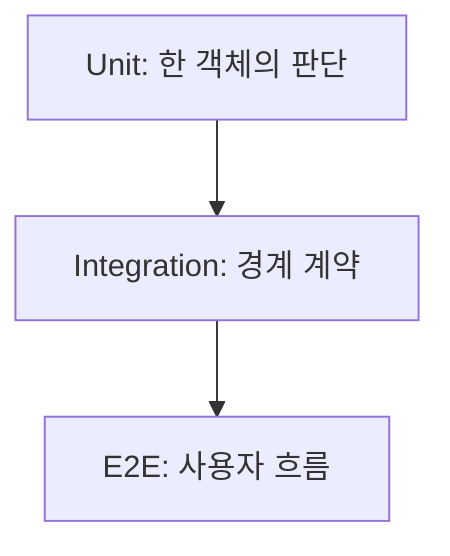

## 핵심

단위 테스트는 한 객체의 판단을 빠르게 검증하고, 통합 테스트는 DB·Kafka·ES 같은 실제 경계와의 계약을 확인한다. Mockito mock이 많다고 좋은 테스트가 되는 것은 아니다.

테스트를 읽을 때는 `given → when → then`을 찾는다.

1. 어떤 입력과 외부 상태를 준비했는가?
2. 어떤 메서드를 실행했는가?
3. 반환값·상태·호출·예외 중 무엇을 검증했는가?

<b>실패 재현 테스트</b>

운영 장애를 글로만 설명하지 말고, 실패 응답·동시 실행·부분 성공처럼 다시 발생할 조건을 테스트로 고정한다. PR4의 bulk 실패 검증과 재시도 관측성은 이런 회귀를 막기 위한 계약이다.

