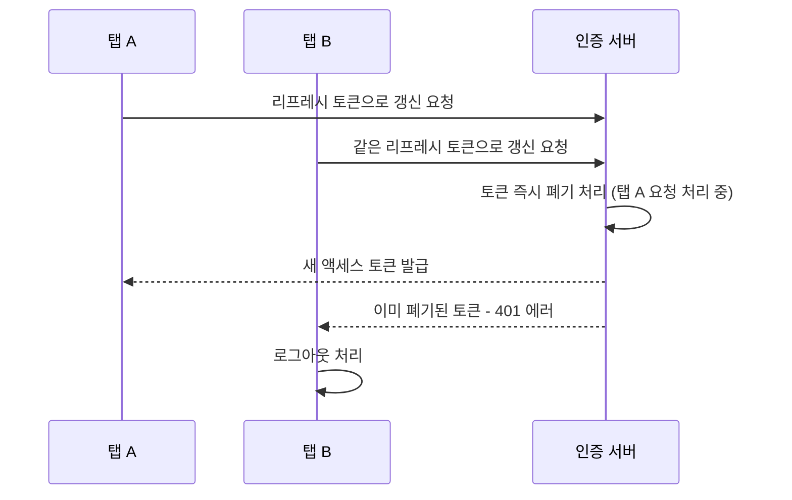

# Diagram Rendering + Image Lightbox Implementation Plan

> **For agentic workers:** REQUIRED SUB-SKILL: Use superpowers:subagent-driven-development (recommended) or superpowers:executing-plans to implement this plan task-by-task. Steps use checkbox (`- [ ]`) syntax for tracking.

**Goal:** Let content authors write mermaid text diagrams in mdx body content that auto-render as SVG in the browser, and let readers click any image or rendered diagram to view it enlarged in a lightbox — without changing the existing static-HTML/`dangerouslySetInnerHTML` rendering architecture.

**Architecture:** `components/markdown.tsx` becomes a client component. It still renders the server-compiled HTML via `dangerouslySetInnerHTML`, but after mount it progressively enhances that DOM in two independent passes: (1) find `pre code.language-mermaid` blocks and replace them with mermaid-rendered SVG (dynamically imported only when such blocks exist), and (2) attach one delegated click listener that opens a lightbox overlay for any clicked `` or rendered diagram. Because all four content types (project/troubleshooting/study/decisions) render through this one component, the change applies everywhere automatically.

**Tech Stack:** Next.js 15 client component, `mermaid` npm package (dynamically imported), Tailwind CSS v4, plain CSS for the fixed-position overlay (matching this file's existing print-styles pattern).

## Global Constraints

- No MDX runtime is introduced. The server-side Velite compile pipeline is untouched; all new behavior is client-side DOM post-processing of the already-compiled HTML.
- No build-time headless-browser diagram pre-rendering (e.g. playwright/rehype-mermaid) — out of scope per spec.
- `mermaid` must only be loaded (dynamic `import('mermaid')`) on pages that actually contain a `pre code.language-mermaid` block. Pages without diagrams must not trigger that network request.
- A mermaid syntax error in one block must not break rendering of the rest of the page — leave the original code block in place and show a small inline error message instead.
- Lightbox closes on: clicking the overlay background, clicking a close button, or pressing `Escape`. Clicking the enlarged content itself must not close it.
- Content authoring convention (for future posts, human-authored, not skill-authored): images go in `public/{project}/images/` and are referenced with standard `` markdown; diagrams use fenced ` ```mermaid ` code blocks. `publish-study`/`publish-troubleshooting`/`publish-decision` skills are unchanged — they still only draft text.

---

### Task 1: Mermaid rendering + lightbox in the Markdown component

**Files:**
- Modify: `package.json`
- Modify: `components/markdown.tsx`
- Modify: `app/globals.css`

**Interfaces:**
- Produces: `Markdown({ content }: { content: string })` — same public signature as before (no caller changes needed in `post-article.tsx` or `app/projects/[slug]/page.tsx`).

- [ ] **Step 1: Install the `mermaid` dependency**

Run: `cd C:/cowork/portfolio && npm install mermaid`

Expected: `package.json` gains a `"mermaid": "^11.x.x"` entry under `dependencies`, `package-lock.json` updates, install completes with no errors.

- [ ] **Step 2: Rewrite `components/markdown.tsx` as a client component with mermaid rendering and lightbox**

Replace the entire file contents:

```tsx
'use client'

import { useEffect, useRef, useState } from 'react'

type LightboxContent = { type: 'image'; src: string; alt: string } | { type: 'svg'; markup: string }

let mermaidInitialized = false

async function renderMermaidDiagrams(container: HTMLElement) {
  const blocks = container.querySelectorAll<HTMLElement>('pre code.language-mermaid')
  if (blocks.length === 0) return

  const mermaid = (await import('mermaid')).default

  if (!mermaidInitialized) {
    const isDark = document.documentElement.classList.contains('dark')
    mermaid.initialize({ startOnLoad: false, theme: isDark ? 'dark' : 'default' })
    mermaidInitialized = true
  }

  let index = 0
  for (const block of Array.from(blocks)) {
    const pre = block.closest('pre')
    if (!pre) continue
    const source = block.textContent ?? ''
    const id = `mermaid-diagram-${Date.now()}-${index++}`
    try {
      const { svg } = await mermaid.render(id, source)
      const wrapper = document.createElement('div')
      wrapper.className = 'mermaid-diagram'
      wrapper.innerHTML = svg
      pre.replaceWith(wrapper)
    } catch {
      const notice = document.createElement('p')
      notice.className = 'mermaid-error'
      notice.textContent = '다이어그램을 렌더링하지 못했습니다.'
      pre.insertAdjacentElement('afterend', notice)
    }
  }
}

export function Markdown({ content }: { content: string }) {
  const containerRef = useRef<HTMLDivElement>(null)
  const [lightbox, setLightbox] = useState<LightboxContent | null>(null)

  useEffect(() => {
    const container = containerRef.current
    if (!container) return
    renderMermaidDiagrams(container)
  }, [content])

  useEffect(() => {
    const container = containerRef.current
    if (!container) return

    function handleClick(event: MouseEvent) {
      const target = event.target as HTMLElement
      if (target.tagName === 'IMG') {
        const img = target as HTMLImageElement
        setLightbox({ type: 'image', src: img.src, alt: img.alt })
        return
      }
      const diagram = target.closest('.mermaid-diagram')
      if (diagram) {
        setLightbox({ type: 'svg', markup: diagram.innerHTML })
      }
    }

    container.addEventListener('click', handleClick)
    return () => container.removeEventListener('click', handleClick)
  }, [])

  useEffect(() => {
    if (!lightbox) return
    function handleKeyDown(event: KeyboardEvent) {
      if (event.key === 'Escape') setLightbox(null)
    }
    document.addEventListener('keydown', handleKeyDown)
    return () => document.removeEventListener('keydown', handleKeyDown)
  }, [lightbox])

  return (
    <>
      <div ref={containerRef} className="prose-content" dangerouslySetInnerHTML={{ __html: content }} />
      {lightbox ? (
        <div className="lightbox-overlay" onClick={() => setLightbox(null)} role="dialog" aria-modal="true" aria-label="확대 보기">
          <button type="button" className="lightbox-close" onClick={() => setLightbox(null)} aria-label="닫기">
            ✕
          </button>
          {lightbox.type === 'image' ? (
            // eslint-disable-next-line @next/next/no-img-element
             event.stopPropagation()}
            />
          ) : (
            <div
              className="lightbox-content"
              onClick={(event) => event.stopPropagation()}
              dangerouslySetInnerHTML={{ __html: lightbox.markup }}
            />
          )}
        </div>
      ) : null}
    </>
  )
}
```

- [ ] **Step 3: Add zoom-in cursor and diagram/error styles to `app/globals.css`**

Add after the existing `.prose-content strong` rule (do not modify any existing rule):

```css
.prose-content img {
  @apply my-4 cursor-zoom-in rounded-md border border-border;
}
.prose-content .mermaid-diagram {
  @apply my-4 flex cursor-zoom-in justify-center overflow-x-auto;
}
.prose-content .mermaid-error {
  @apply my-2 text-sm text-destructive;
}
```

- [ ] **Step 4: Add lightbox overlay styles to `app/globals.css`**

Add at the end of the file, after the existing `@media print` block:

```css
/* Lightbox overlay for enlarged images/diagrams */
.lightbox-overlay {
  position: fixed;
  inset: 0;
  z-index: 50;
  display: flex;
  align-items: center;
  justify-content: center;
  background: oklch(0 0 0 / 80%);
  padding: 2rem;
  cursor: zoom-out;
}
.lightbox-content {
  max-width: 90vw;
  max-height: 90vh;
  cursor: default;
}
.lightbox-close {
  position: fixed;
  top: 1.5rem;
  right: 1.5rem;
  z-index: 51;
  display: flex;
  width: 2.5rem;
  height: 2.5rem;
  align-items: center;
  justify-content: center;
  border-radius: 9999px;
  border: none;
  background: oklch(1 0 0 / 15%);
  color: white;
  font-size: 1.1rem;
  cursor: pointer;
}
```

- [ ] **Step 5: Run the build to verify the component compiles**

Run: `cd C:/cowork/portfolio && npm run build`
Expected: build succeeds with no type errors. No content currently uses mermaid blocks, so no visual change yet — this step only confirms the component and CSS compile.

- [ ] **Step 6: Run the full test suite to confirm no regressions**

Run: `cd C:/cowork/portfolio && npm run test`
Expected: all 38 existing tests still pass (this task adds no automated tests — DOM-manipulating effects aren't unit-testable under this repo's `vitest.config.ts` `environment: 'node'` setting, and pages/components in this repo are verified via build + manual browser check by existing convention, not unit tests).

- [ ] **Step 7: Commit**

```bash
cd C:/cowork/portfolio
git add package.json package-lock.json components/markdown.tsx app/globals.css
git commit -m "Add mermaid diagram rendering and image/diagram lightbox to Markdown"
```

---

### Task 2: Demo content + end-to-end browser verification

**Files:**
- Modify: `content/career-link/troubleshooting/security/jwt-refresh-race.mdx`

**Interfaces:**
- Consumes: `Markdown` component's mermaid-rendering and lightbox behavior from Task 1. No code interfaces produced (content-only task).

- [ ] **Step 1: Add a mermaid sequence diagram illustrating the race condition**

In `content/career-link/troubleshooting/security/jwt-refresh-race.mdx`, insert the diagram between the "## 원인" paragraph and the "## 해결" heading:

```mdx
## 원인

리프레시 토큰을 1회용으로 즉시 폐기하면서, 거의 동시에 도착한 두 번째 요청이 이미 폐기된 토큰을 들고 오는 레이스 컨디션이 발생했습니다.



## 해결
```

(The full file already has this exact "## 원인" paragraph and "## 해결" heading immediately adjacent — insert the mermaid block between them, everything else in the file stays unchanged.)

- [ ] **Step 2: Add an image reference to the existing thumbnail**

At the end of the file, after the existing "## 결과" paragraph, append:

```mdx


```

- [ ] **Step 3: Run the build**

Run: `cd C:/cowork/portfolio && npm run build`
Expected: build succeeds.

- [ ] **Step 4: Manually verify in the browser**

Run: `cd C:/cowork/portfolio && npm run dev`

Open `/troubleshooting/career-link/security/jwt-refresh-race` and check:
- The mermaid code block renders as an actual sequence diagram (SVG), not raw text.
- Clicking the diagram opens the lightbox with the diagram enlarged; clicking the background or pressing `Escape` closes it; clicking the diagram itself inside the lightbox does not close it.
- The thumbnail image at the bottom renders normally and, when clicked, opens the lightbox with the enlarged image; same close behavior as above.
- Open browser dev tools' Network tab, then open `/troubleshooting/career-link/api/rate-limit-429` (a post with no mermaid block) and confirm no request for a `mermaid` chunk is made.
- Toggle dark mode via the theme switcher, reload the diagram page, and confirm the diagram is still readable (not testing live re-theme of an already-rendered diagram — only that a fresh page load in dark mode renders it legibly).

- [ ] **Step 5: Commit**

```bash
cd C:/cowork/portfolio
git add content/career-link/troubleshooting/security/jwt-refresh-race.mdx
git commit -m "Add mermaid diagram and image to jwt-refresh-race post as a rendering demo"
```

---

## Post-Plan Verification (whole-feature check)

- `npm run test` — all 38 tests pass (no new tests added; matches existing repo convention).
- `npm run build` — succeeds.
- Browser check per Task 2 Step 4: diagram renders, lightbox opens/closes correctly for both image and diagram, no-diagram pages don't load the `mermaid` chunk, dark mode diagram is legible on fresh load.
